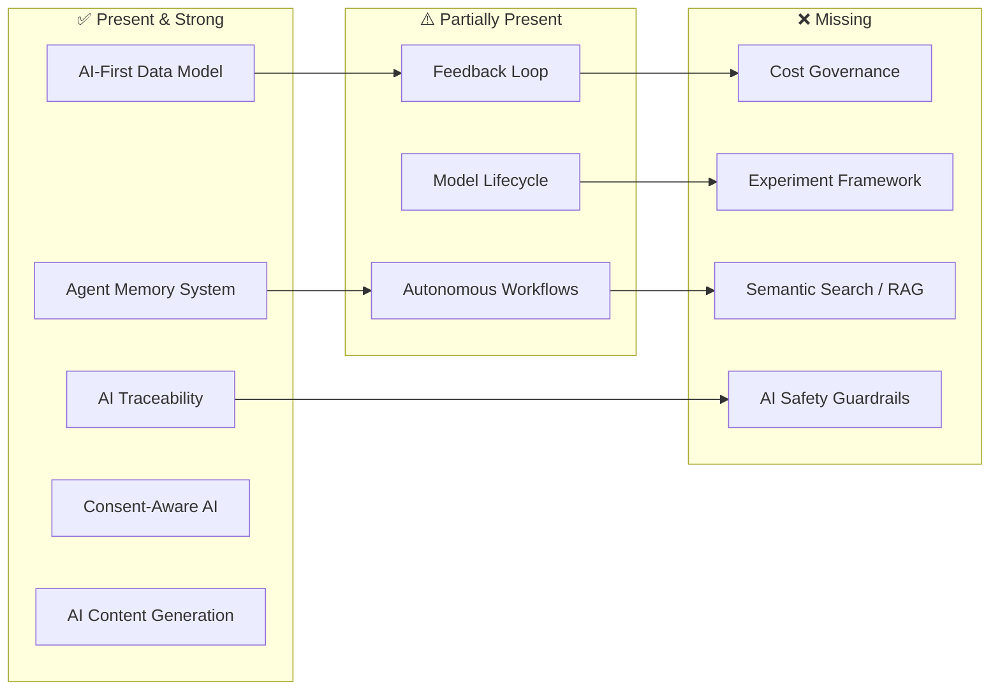

# AI Native Analysis — Account Planning v0

## 1. What Does "AI Native" Mean?

Before evaluating, let's define the bar. An application can safely call itself **AI Native** when AI is not bolted on as a feature — it is a **structural assumption** embedded into the data model, the control plane, and the user experience from day one. Specifically:

| Pillar | Definition |
|--------|-----------|
| **AI-First Data Model** | Every entity schema is designed for AI consumption, not just human CRUD. Data is pre-aggregated, cache-layered, and explainability-ready. |
| **Agent Infrastructure** | The system has persistent memory, conversation state, prompt management, and preference hierarchies — not just an LLM API call wrapper. |
| **Closed Feedback Loop** | AI outputs (briefings, actions, scores) collect structured human feedback that flows back into model evaluation and prompt improvement. |
| **Full Traceability** | Every AI decision is reproducible: input context → prompt → response → parsed output → downstream effect — all logged and auditable. |
| **AI-Driven Workflows** | Core business workflows (actions, escalations, content generation) can be initiated, executed, and completed by AI agents autonomously. |
| **Consent-Aware AI** | AI processing respects granular consent, PII boundaries, and regulatory explainability requirements (KVKK Art.22 / GDPR Art.22). |

---

## 2. Current Architecture Score Card

### ✅ Already Strong (Safely Claimable)

These pillars are **structurally embedded** in the data model today:

---

#### 2.1 AI-First Data Model

| Evidence | Schema / Table |
|----------|---------------|
| **Customer 360 Cache** — Denormalized JSONB document specifically designed for sub-millisecond AI agent reads. Contains profile, product, segment, performance, analytics, action, and risk summaries in a single row. | [customer.customer_360_cache](file:///Users/alperaydin/Library/CloudStorage/GoogleDrive-alperaydyn@gmail.com/My%20Drive/Projects/AccountPlanning/db_design/v0/implementation_plan.md#L501-L516) |
| **SHAP Explanations** — Model scores are accompanied by structured feature contributions, human-readable reasons, and actionable sales hints. Not just a raw score — the *why* is a first-class entity. | [analytics.model_explanation](file:///Users/alperaydin/Library/CloudStorage/GoogleDrive-alperaydyn@gmail.com/My%20Drive/Projects/AccountPlanning/db_design/v0/sql/06_analytics.sql#L113-L130) |
| **Temporal Score Metadata** — Every prediction carries `base_period_start/end`, `prediction_date`, `scored_at`, `expires_at`, and `batch_id`. An AI agent knows exactly *what data window* a score is based on and *when it goes stale*. | [analytics.model_score](file:///Users/alperaydin/Library/CloudStorage/GoogleDrive-alperaydyn@gmail.com/My%20Drive/Projects/AccountPlanning/db_design/v0/sql/06_analytics.sql#L57-L74) |
| **Action Context JSONB** — Every action stores an AI reasoning snapshot (`context` field) with the model scores, customer health signals, and natural-language justification that triggered it. | [action.action.context](file:///Users/alperaydin/Library/CloudStorage/GoogleDrive-alperaydyn@gmail.com/My%20Drive/Projects/AccountPlanning/db_design/v0/sql/07_action.sql#L311) |

> [!TIP]
> The Customer 360 cache alone puts this architecture ahead of most "AI-added" systems, where agents must join 10+ tables at query time. This is a genuine AI-first design decision.

---

#### 2.2 Agent Infrastructure

| Evidence | Schema / Table |
|----------|---------------|
| **Conversations + Messages** — Full transcript storage with role tracking (user/assistant/system/tool), token counting, model attribution, and structured content for tool calls. | [agent.conversation](file:///Users/alperaydin/Library/CloudStorage/GoogleDrive-alperaydyn@gmail.com/My%20Drive/Projects/AccountPlanning/db_design/v0/sql/12_agent.sql#L54-L67), [agent.conversation_message](file:///Users/alperaydin/Library/CloudStorage/GoogleDrive-alperaydyn@gmail.com/My%20Drive/Projects/AccountPlanning/db_design/v0/sql/12_agent.sql#L127-L139) |
| **Short-Term Memory** — Ephemeral agent scratchpad with TTL expiry (`context`, `working`, `scratch`, `tool_state`). Bridges the gap between LLM context window limits and multi-step workflows. | [agent.memory_short_term](file:///Users/alperaydin/Library/CloudStorage/GoogleDrive-alperaydyn@gmail.com/My%20Drive/Projects/AccountPlanning/db_design/v0/sql/12_agent.sql#L192-L205) |
| **Long-Term Memory** — Persistent entity-scoped knowledge base with 7 memory categories, confidence scoring (0–1), source attribution, and relevance decay via `last_accessed_at`. | [agent.memory_long_term](file:///Users/alperaydin/Library/CloudStorage/GoogleDrive-alperaydyn@gmail.com/My%20Drive/Projects/AccountPlanning/db_design/v0/sql/12_agent.sql#L283-L302) |
| **Hierarchical Preferences** — 5-level override hierarchy (tenant → lob → region → team → user) for agent behavior tuning without code changes. | [agent.preference](file:///Users/alperaydin/Library/CloudStorage/GoogleDrive-alperaydyn@gmail.com/My%20Drive/Projects/AccountPlanning/db_design/v0/sql/12_agent.sql#L366-L378) |
| **Prompt Template Management** — Versioned, tenant-isolated prompts with input/output JSON Schema validation, model config, approval workflow (draft → testing → active → deprecated). | [agent.prompt_template](file:///Users/alperaydin/Library/CloudStorage/GoogleDrive-alperaydyn@gmail.com/My%20Drive/Projects/AccountPlanning/db_design/v0/sql/12_agent.sql#L450-L469) |

> [!IMPORTANT]
> This is a complete agentic memory system — not just "we call an LLM API". The separation of short-term (session-scoped, TTL-based) and long-term (entity-scoped, confidence-decaying) memory is a hallmark of mature AI agent architectures.

---

#### 2.3 Full AI Traceability

| Evidence | Schema / Table |
|----------|---------------|
| **AI Reasoning Chain Log** — Complete prompt→response→decision trail. Stores rendered prompt, raw model response, parsed output, confidence, token usage, model name, and latency. Partitioned monthly. | [audit.ai_reasoning_log](file:///Users/alperaydin/Library/CloudStorage/GoogleDrive-alperaydyn@gmail.com/My%20Drive/Projects/AccountPlanning/db_design/v0/sql/09_audit.sql#L116-L141) |
| **Action Trigger Traceability** — `trigger_module`, `trigger_function`, `trigger_event_type`, `trigger_call_stack` on every action instance. Traces exactly which code path created an AI-recommended action. | [action.action](file:///Users/alperaydin/Library/CloudStorage/GoogleDrive-alperaydyn@gmail.com/My%20Drive/Projects/AccountPlanning/db_design/v0/sql/07_action.sql#L325-L328) |
| **Execution Cost Tracking** — `model_used`, `tokens_input`, `tokens_output`, `cost_usd`, `cost_metadata` on every automated execution attempt. Enables per-decision cost attribution. | [action.action_execution_log](file:///Users/alperaydin/Library/CloudStorage/GoogleDrive-alperaydyn@gmail.com/My%20Drive/Projects/AccountPlanning/db_design/v0/sql/07_action.sql#L641-L645) |
| **Content Generation Provenance** — `generated_by`, `ai_context`, `generation_trigger` on briefings and insights. | [content.briefing](file:///Users/alperaydin/Library/CloudStorage/GoogleDrive-alperaydyn@gmail.com/My%20Drive/Projects/AccountPlanning/db_design/v0/sql/08_content.sql#L104-L126) |

---

#### 2.4 Consent-Aware AI

| Evidence | Schema / Table |
|----------|---------------|
| **Granular Consent Tracking** — 5 consent types (`data_processing`, `marketing`, `profiling`, `cross_sell`, `third_party_sharing`) with legal basis, evidence reference, and expiry. | [customer.consent](file:///Users/alperaydin/Library/CloudStorage/GoogleDrive-alperaydyn@gmail.com/My%20Drive/Projects/AccountPlanning/db_design/v0/implementation_plan.md#L471-L487) |
| **Data Access Logging** — Every PII access logged with purpose, enabling KVKK Art. 22 compliance. | [audit.data_access_log](file:///Users/alperaydin/Library/CloudStorage/GoogleDrive-alperaydyn@gmail.com/My%20Drive/Projects/AccountPlanning/db_design/v0/sql/09_audit.sql#L199-L211) |
| **Right to Erasure** — `deleted_at` + `anonymized_at` on customer table with data retention policies per category per tenant. | [customer.data_retention_policy](file:///Users/alperaydin/Library/CloudStorage/GoogleDrive-alperaydyn@gmail.com/My%20Drive/Projects/AccountPlanning/db_design/v0/implementation_plan.md#L488-L499) |

---

### ⚠️ Partially Present (Needs Completion)

These capabilities exist structurally but are **incomplete or marked [FUTURE]**:

---

#### 2.5 Closed Feedback Loop

| What exists | What's missing |
|------------|---------------|
| `content.briefing_feedback` — thumbs up/down + text per briefing per user | No feedback mechanism on **action recommendations** — was the AI's suggested action useful? |
| `content.briefing_read_tracking` — engagement time tracking | No feedback aggregation → prompt template performance scoring pipeline |
| `agent.prompt_template` — versioned prompts with approval workflow | No automated **prompt A/B testing** framework — version promotion is manual |

---

#### 2.6 Model Lifecycle Management

| What exists | What's missing |
|------------|---------------|
| `analytics.model` — model registry with status lifecycle | `performance_metrics`, `training_metadata`, `ab_test_config` are all **[FUTURE]** — reserved but empty |
| Model scores with temporal metadata | No **model drift detection** table or scheduled comparison mechanism |
| Score → Action traceability via `source_model_id` | No **impact measurement** table that closes the loop: did actions triggered by model X actually improve outcomes? |

---

#### 2.7 AI-Driven Workflows

| What exists | What's missing |
|------------|---------------|
| `action.action_type.is_automated` + `automation_config` | No **agent orchestration** table — what happens when an agent needs to coordinate multiple tool calls across a multi-step plan? |
| `action.action.source = 'ai_recommended'` | No **human-in-the-loop approval gate** table for high-risk AI decisions (the `approved_by` field exists on action_type but not on individual AI-recommended actions) |
| Escalation rules with auto-notification | No **agent skill/capability registry** — what tools/APIs can each agent type invoke? |

---

### ❌ Missing (Required for Full AI Native Claim)

| Gap | Why it matters |
|-----|---------------|
| **Vector/Embedding Storage** | No `pgvector` extension or embedding table for semantic search over customer notes, conversation history, or document content. AI agents cannot do RAG without this. |
| **AI Guardrails / Safety** | No table for content filtering rules, PII redaction policies for LLM prompts, or output validation rules. |
| **Agent Tool Registry** | No structured catalog of what tools/APIs each agent type can call, with permission boundaries. |
| **Experiment / A/B Framework** | The model registry has `ab_test_config` reserved but no experiment tracking tables exist. |
| **Prompt Performance Metrics** | No table to aggregate feedback scores per prompt_template version, enabling data-driven prompt promotion. |
| **AI Cost Budget & Alerts** | Cost fields exist on `action_execution_log` but no budget/threshold/alert table per tenant. |

---

## 3. Action List — Path to Safely Calling This "AI Native"

> [!IMPORTANT]
> The actions below are ordered by **impact on the AI Native claim** (highest first) and grouped by category. Each action specifies what to build and why it matters.

### Category A — Close the Feedback Loop

| # | Action | Affected Schema | Reason |
|---|--------|----------------|--------|
| **A1** | Add `action.action_feedback` table: `action_id`, `user_id`, `relevance_rating` (1–5), `outcome_accuracy` (1–5), `feedback_text`, `created_at` | `action` | AI-recommended actions currently have no feedback signal. Without this, the system cannot measure whether its recommendations are useful — and "useful AI" is the core of AI Native. |
| **A2** | Add `agent.prompt_template_performance` table: `template_id`, `period_start`, `period_end`, `invocation_count`, `avg_latency_ms`, `avg_tokens`, `avg_feedback_score`, `error_rate`, `calculated_at` | `agent` | Prompt versions are promoted manually today. This table enables data-driven promotion by aggregating feedback, latency, and error rates per template version. |
| **A3** | Add `analytics.model_impact` table: `model_id`, `period`, `actions_generated`, `actions_completed`, `positive_outcomes`, `revenue_attributed`, `lift_vs_baseline`, `calculated_at` | `analytics` | Closes the model → action → outcome → model improvement loop. Without impact measurement, the model registry is just a catalog, not an intelligence engine. |

### Category B — Add Semantic Intelligence

| # | Action | Affected Schema | Reason |
|---|--------|----------------|--------|
| **B1** | Add `pgvector` extension to `00_extensions_and_schemas.sql` | foundation | Prerequisite for embedding storage. Without vector similarity search, agents cannot do RAG — they are limited to exact-match SQL queries. |
| **B2** | Add `agent.embedding` table: `id`, `tenant_id`, `entity_type`, `entity_id`, `content_hash`, `embedding vector(1536)`, `model_name`, `created_at` | `agent` | Enables semantic search over customer notes, conversation history, long-term memory, and documents. This is the backbone of intelligent retrieval. |
| **B3** | Add `agent.knowledge_base` table: `id`, `tenant_id`, `source_type` (document/FAQ/policy), `content`, `embedding_id`, `metadata`, `is_active`, `created_at` | `agent` | Structured RAG source catalog. Without this, agents have no curated knowledge base beyond raw database rows. |

### Category C — Add AI Safety & Governance

| # | Action | Affected Schema | Reason |
|---|--------|----------------|--------|
| **C1** | Add `agent.guardrail` table: `id`, `tenant_id`, `agent_type`, `rule_type` (pii_filter/topic_block/output_validation), `rule_config` (JSONB), `severity`, `is_active` | `agent` | An AI Native system must enforce safety boundaries at the data layer, not just hope the prompt handles it. This table defines per-tenant, per-agent guardrails. |
| **C2** | Add `agent.guardrail_violation_log` table: `id`, `tenant_id`, `guardrail_id`, `conversation_id`, `violation_detail`, `action_taken` (blocked/redacted/flagged), `occurred_at` | `agent` / `audit` | Auditability of safety enforcement. Banks need proof that PII was not leaked to LLMs. |
| **C3** | Add `agent.tool_registry` table: `id`, `tenant_id`, `agent_type`, `tool_name`, `tool_description`, `api_config`, `permission_scope`, `is_active` | `agent` | Formalizes what each agent can do. Without this, tool access is implicit in code — opaque to auditors and non-reproducible across tenants. |
| **C4** | Add `consent_type = 'ai_profiling'` and `consent_type = 'ai_automated_decision'` to `customer.consent` CHECK constraint | `customer` | KVKK Art. 22 / GDPR Art. 22 specifically requires explicit consent for automated decision-making. The current consent types don't cover this precisely. |

### Category D — Complete Model Lifecycle

| # | Action | Affected Schema | Reason |
|---|--------|----------------|--------|
| **D1** | Populate `analytics.model.performance_metrics` and `training_metadata` schemas — remove `[FUTURE]` label, define JSON Schema contracts | `analytics` | These fields exist but are undocumented and unused. Defining the schema turns them from aspirational to operational. |
| **D2** | Add `analytics.experiment` table: `id`, `tenant_id`, `model_id`, `experiment_type` (a/b/champion_challenger), `config`, `status`, `started_at`, `ended_at`, `results` | `analytics` | Formalizes model experimentation. Without this, model version switching is a deployment decision, not a data-driven one. |
| **D3** | Add `analytics.model_drift_check` table: `id`, `model_id`, `check_type` (data_drift/concept_drift/performance), `metrics`, `status` (ok/warning/critical), `checked_at` | `analytics` | AI Native systems must detect when their models go stale. This table stores periodic drift assessments. |

### Category E — Operationalize AI Costs

| # | Action | Affected Schema | Reason |
|---|--------|----------------|--------|
| **E1** | Add `config.ai_cost_budget` table: `id`, `tenant_id`, `budget_type` (monthly/per_agent/per_model), `limit_usd`, `alert_threshold_pct`, `current_usage_usd`, `period_start`, `period_end` | `config` | Cost fields exist on `action_execution_log` but there's no budget enforcement. An AI Native SaaS must offer tenants cost visibility and controls. |
| **E2** | Add `agent.token_usage_daily` aggregation table: `tenant_id`, `date`, `agent_type`, `model_name`, `total_input_tokens`, `total_output_tokens`, `total_cost_usd`, `invocation_count` | `agent` | Pre-aggregated daily rollups for the cost dashboard. Querying raw `action_execution_log` partitions for billing is too expensive at scale. |

---

## 4. Maturity Assessment

### Current Score: **65/100** — "AI-Ready" but not yet "AI Native"

| Rating | Meaning | Score Range |
|--------|---------|-------------|
| AI-Aware | Has some AI features bolted on | 20–40 |
| **AI-Ready** | **Data model designed for AI, agent infra exists, but loops not closed** | **50–70** |
| AI Native | Full closed-loop AI with safety, feedback, cost governance, and semantic intelligence | 75–90 |
| AI-First | AI is the primary user of the system; humans supervise | 90–100 |

> [!CAUTION]
> **You can safely call this "AI Native" after completing categories A + B + C** (actions A1–A3, B1–B3, C1–C4). Categories D and E upgrade the claim from "AI Native" to "AI-First" — they're excellent but not required for the base label.

---

## 5. Priority Execution Order

If implementing incrementally, this is the recommended order:

| Phase | Actions | Effort | Impact |
|-------|---------|--------|--------|
| **Phase 1** — Close loops | A1, A2, C4 | Low (3 tables + 1 constraint edit) | Enables feedback-driven AI improvement |
| **Phase 2** — Add safety | C1, C2, C3 | Medium (3 tables) | Makes AI auditable and governable — critical for banking |
| **Phase 3** — Semantic layer | B1, B2, B3 | Medium (extension + 2 tables) | Unlocks RAG and intelligent retrieval |
| **Phase 4** — Model lifecycle | A3, D1, D2, D3 | Medium (3 tables + schema docs) | Completes the model improvement flywheel |
| **Phase 5** — Cost governance | E1, E2 | Low (2 tables) | Enables per-tenant AI cost management |

---

## 6. Summary

The Account Planning v0 database has an **exceptionally strong AI foundation** — stronger than most systems that already call themselves "AI Native". The agent schema (memory, conversations, preferences, prompts), the analytics schema (model registry, temporal scores, SHAP explanations), the action schema (AI-recommended source tracing, DAG workflows), and the audit schema (full reasoning chains) collectively form a coherent agentic AI data layer.

What prevents the safe "AI Native" label today is the **absence of three closed loops**:

1. **Feedback → Prompt Improvement** (humans rate AI output → metrics drive prompt version promotion)
2. **Model → Impact Measurement** (model scores → actions → outcomes → model evaluation)
3. **Semantic Retrieval** (embeddings + vector search → RAG for agent context)

And the **absence of AI governance infrastructure**: guardrails, tool registries, cost budgets, and AI-specific consent types.

Complete **Phases 1–3** (10 actions) and the "AI Native" label becomes defensible.
