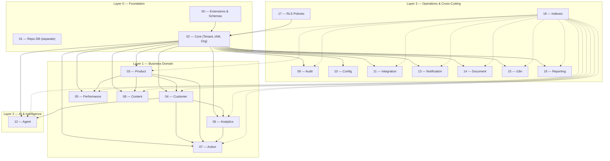
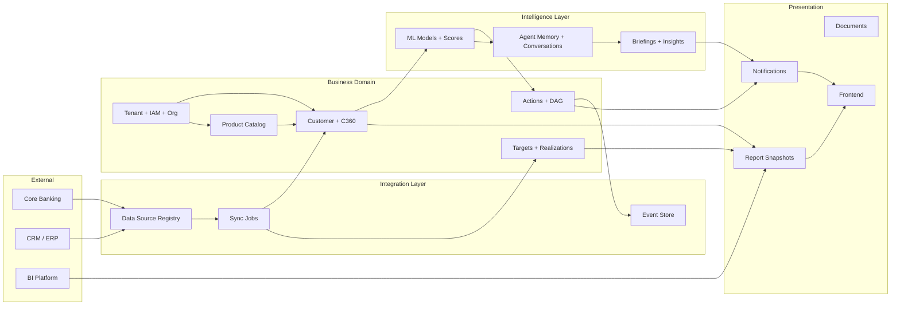

# Account Planning — Architecture Design Brief

## System Identity

**Account Planning** is an enterprise-grade, AI-first, multi-tenant Sales & Performance Assistant built on PostgreSQL 16+. It serves as the operational backbone for relationship managers, branch heads, and regional directors in banking/financial services, integrating performance tracking, customer intelligence, and agentic AI workflows into a single platform.

---

## Schema Dependency Map



---

## Table Inventory by Schema

| # | Schema | File | Tables | Partitioned? | Key Tables |
|---|--------|------|--------|-------------|------------|
| 0 | *(extensions)* | `00_extensions_and_schemas.sql` | 0 (schemas only) | — | 16 schemas + 3 extensions |
| 1 | `repo` | `01_repo.sql` | 3 | No | `app_setting`, `module_registry`, `migration_log` |
| 2 | `core` | `02_core.sql` | 10 | No | `tenant`, `user_`, `abac_policy`, `org_unit`, `org_unit_closure`, `employee`, `reporting_period` |
| 3 | `product` | `03_product.sql` | 4 | No | `category` + closure, `product`, `product_version`, `product_relationship` |
| 4 | `customer` | `04_customer.sql` | 9 | No | `customer`, `customer_segment`, `customer_product`, `customer_transaction`, `consent`, `customer_360_cache` |
| 5 | `perf` | `05_perf.sql` | 5 | No | `metric_definition`, `target` (3-tier), `realization`, `scorecard`, `scorecard_component` |
| 6 | `analytics` | `06_analytics.sql` | 3 | **Yes** (model_score) | `model`, `model_score` (monthly), `model_explanation` |
| 7 | `action` | `07_action.sql` | 8 | **Yes** (execution_log) | `status_definition`, `action_type`, `action` (DAG), `action_recurrence`, `action_escalation_rule` |
| 8 | `content` | `08_content.sql` | 6 | No | `template`, `briefing`, `product_insight`, `action_insight`, feedback + read tracking |
| 9 | `audit` | `09_audit.sql` | 3 | **Yes** (all 3) | `audit_log`, `ai_reasoning_log`, `data_access_log` |
| 10 | `config` | `10_config.sql` | 4 | No | `change_request`, `change_request_approval`, `feature_flag`, `config_version` |
| 11 | `integration` | `11_integration.sql` | 5 | **Yes** (event) | `data_source`, `sync_job`, `webhook`, `webhook_delivery`, `event` (event store) |
| 12 | `agent` | `12_agent.sql` | 6 | No | `conversation`, `conversation_message`, `memory_short_term`, `memory_long_term`, `preference`, `prompt_template` |
| 13 | `notification` | `13_notification.sql` | 4 | No | `channel`, `template`, `notification`, `preference` |
| 14 | `document` | `14_document.sql` | 4 | No | `document`, `document_version`, `document_link` (polymorphic), `document_access_log` |
| 15 | `i18n` | `15_i18n.sql` | 3 | No | `supported_language`, `translation`, `user_language_preference` |
| 16 | `reporting` | `16_reporting.sql` | 4 | No | `report_definition`, `materialized_view_registry`, `report_snapshot`, `report_access_log` |
| 17 | *(policies)* | `17_rls_policies.sql` | 0 (policies only) | — | RLS on all tenant-scoped tables + `current_tenant_id()` helper |
| 18 | *(indexes)* | `18_indexes.sql` | 0 (indexes only) | — | ~50 strategic indexes, all tenant_id-leading |

**Total: ~76 tables + 4 partitioned parent tables (with 12 monthly partitions each = 48 partition tables)**

---

## Key Design Patterns

### 1. Multi-Tenancy (Row-Level Security)
- **Every table** carries `tenant_id UUID NOT NULL REFERENCES core.tenant(id)`.
- RLS policies use `SET app.current_tenant_id = '<uuid>'` session variable.
- `core.current_tenant_id()` helper function raises an exception if not set.
- Indexes lead with `tenant_id` for RLS-efficient scans.

### 2. Closure Tables (O(1) Hierarchy Reads)
- **`core.org_unit_closure`** — org hierarchy (company → lob → region → area → branch → team).
- **`product.category_closure`** — product category tree.
- Every ancestor-descendant pair is pre-materialized with `depth`.
- Write-time cost, query-time benefit.

### 3. ABAC (Attribute-Based Access Control)
- `core.abac_policy` uses JSONB `conditions` and `permissions` instead of RBAC roles.
- Context-aware: can evaluate time-of-day, device, location, org membership.
- Delegation & impersonation tracked via `core.delegation` and `core.impersonation_log`.

### 4. Range Partitioning (High-Volume Tables)
- `analytics.model_score` — by `scored_at` (monthly).
- `action.action_execution_log` — by `created_at` (monthly).
- `audit.audit_log` / `audit.ai_reasoning_log` / `audit.data_access_log` — by `occurred_at` (monthly).
- `integration.event` — by `occurred_at` (monthly).
- **12 pre-created partitions per table (2026-01 → 2026-12).**
- Application/cron must create future partitions before data arrives.

### 5. Polymorphic Entity References
- `perf.target.target_entity_id` → org_unit OR user_ (resolved by `target_level`).
- `document.document_link` → any entity type via `entity_type` + `entity_id`.
- `notification.notification` → any trigger via `trigger_entity_type` + `trigger_entity_id`.

### 6. Event Sourcing
- `integration.event` — immutable event store with sequence numbers per aggregate.
- Supports replay, audit, AI training, and event-driven integration.

### 7. Versioning Pattern
- `product.product_version` — immutable product spec snapshots.
- `content.briefing` / `content.product_insight` — series_id + version + is_current.
- `agent.prompt_template` — code + version + is_current promotion workflow.
- `config.config_version` — draft → staging → production promotion chain.
- `document.document_version` — file revision history.

### 8. Three-Tier Target System
- `perf.target`: `floor_value` / `target_value` / `stretch_value`.
- Enables nuanced performance bands: 🔴 underperforming → 🟡 below target → 🟢 on track → 🏆 exceptional.

### 9. Shared Reporting Period Dimension
- `core.reporting_period` — insert-only time dimension with pre-computed boundaries.
- Referenced by `customer.customer_product_metric`, `customer.customer_transaction`.
- `period_label` and `period_type` denormalized for analyst convenience.

---

## Data Flow Summary



---

## Security & Compliance Architecture

| Concern | Mechanism |
|---------|-----------|
| **Tenant Isolation** | RLS on every table via `app.current_tenant_id` session variable |
| **IAM** | ABAC policies (`core.abac_policy`) with delegation and impersonation |
| **PII Encryption** | Application-layer encryption on marked columns (`customer.customer.name`, `tax_id`, etc.) |
| **Consent Tracking** | `customer.consent` — 7 consent types with legal basis and evidence |
| **Data Retention** | `customer.data_retention_policy` — automated anonymize/delete/archive |
| **Audit Trail (Writes)** | `audit.audit_log` — field-level diffs, partitioned monthly |
| **Audit Trail (Reads)** | `audit.data_access_log` — PII access with stated purpose |
| **AI Explainability** | `audit.ai_reasoning_log` — full prompt→response chain for KVKK Art. 22 |
| **Soft Delete** | `deleted_at` + `anonymized_at` on customer; `is_active` flags everywhere |

---

## Database Topology

```
┌──────────────────────────────────────────────────┐
│               PostgreSQL 16+ Server              │
├──────────────────────┬───────────────────────────┤
│     Main Database    │      Repo Database        │
│  (16 schemas, RLS)   │  (app_setting, modules,   │
│                      │   migration_log)           │
│  Extensions:         │                           │
│  • uuid-ossp         │  No tenant_id, no RLS     │
│  • pgcrypto          │  Shared across all tenants│
│  • btree_gist        │                           │
└──────────────────────┴───────────────────────────┘
```
