# Account Planning — Enterprise Database Architecture v0

## 1. Overview & Design Principles

This document specifies the PostgreSQL database architecture for an **enterprise-grade Agentic AI Sales & Performance Assistant**. The system serves ~100 tenants, each with potentially millions of customers, and supports both human-driven and AI-automated sales workflows.

### Design Principles

| # | Principle | Implication |
|---|-----------|-------------|
| 1 | **Tenant Isolation** | Row-Level Security (RLS) on every tenant-scoped table; `tenant_id` as leading column in all composite indexes |
| 2 | **KVKK/GDPR by Design** | PII encryption markers, consent tracking, soft-delete + anonymization, data retention policies |
| 3 | **AI-First Data Model** | Structured for agent consumption: Customer 360 cache, SHAP explanations, reasoning chain logs, agent memory |
| 4 | **Modular & Configurable** | Tenant-specific statuses, workflow templates, feature flags, prompt templates — all without code changes |
| 5 | **Auditability** | Field-level diffs, immutable event store, AI decision traceability |
| 6 | **Temporal Awareness** | Historical org assignments, product versions, config versions, metric snapshots |
| 7 | **Scalable PostgreSQL** | Strategic partitioning for high-volume tables, proper indexing, tiered audit retention |

### Target Scale

| Metric | Value |
|--------|-------|
| Tenants | ~100 |
| Actions/day/tenant | ~1,500 |
| Model scores/cycle/tenant | 1–2 million |
| Initial deployment | Türkiye |
| Future expansion | Europe |

---

## 2. Schema Organization

The database is organized into **12 PostgreSQL schemas** for logical separation. A separate `repo` database holds application-level (non-tenant) settings.

```mermaid
graph LR
    subgraph "Main Database"
        core["core — Tenancy, IAM, Org"]
        product["product — Catalog & Versions"]
        customer["customer — Data, Segments, 360"]
        perf["perf — Metrics & Targets"]
        analytics["analytics — Models & Scores"]
        action["action — Workflows & DAG"]
        content["content — Briefings & Templates"]
        audit["audit — Logs & Compliance"]
        config["config — Change Mgmt & Flags"]
        integration["integration — Sync & Events"]
        agent["agent — AI Memory & Prompts"]
        notification["notification — Alerts & Delivery"]
        document["document — Files & Attachments"]
        i18n["i18n — Localization"]
        reporting["reporting — Views & Snapshots"]
    end
    subgraph "Repo Database"
        repo["repo — App Settings"]
    end
```



> [!IMPORTANT]
> Every tenant-scoped table includes `tenant_id UUID NOT NULL` as the first column and is protected by RLS policies using `current_setting('app.current_tenant_id')`.

---

## 3. Detailed Schema Designs

### 3.1 `repo` Schema — Application Settings (Separate Database)

This is a **non-tenant** database holding global application configuration.

#### `repo.app_setting`
| Column | Type | Notes |
|--------|------|-------|
| key | VARCHAR(255) PK | Setting key |
| value | JSONB NOT NULL | Setting value |
| description | TEXT | Human-readable description |
| created_at | TIMESTAMPTZ | |
| updated_at | TIMESTAMPTZ | |

#### `repo.supported_module`
| Column | Type | Notes |
|--------|------|-------|
| id | UUID PK | |
| module_code | VARCHAR(100) UNIQUE | e.g., `actions`, `briefings`, `analytics` |
| display_name | VARCHAR(255) | |
| description | TEXT | |
| is_active | BOOLEAN DEFAULT true | |
| default_config | JSONB | Default configuration template |

#### `repo.db_migration`
| Column | Type | Notes |
|--------|------|-------|
| version | VARCHAR(50) PK | Migration version |
| description | TEXT | |
| applied_at | TIMESTAMPTZ | |
| checksum | VARCHAR(64) | |

---

### 3.2 `core` Schema — Tenancy, IAM & Organization

#### 3.2.1 Tenant Management

##### `core.tenant`
| Column | Type | Notes |
|--------|------|-------|
| id | UUID PK | |
| code | VARCHAR(50) UNIQUE | Short code, e.g., `BANK_A` |
| name | VARCHAR(255) | |
| industry | VARCHAR(100) | e.g., `banking`, `telco`, `insurance` |
| status | VARCHAR(20) | `active`, `suspended`, `onboarding`, `decommissioned` |
| settings | JSONB | Tenant-wide settings |
| data_residency_region | VARCHAR(50) | `TR`, `EU`, etc. |
| kvkk_gdpr_config | JSONB | Compliance config (retention periods, DPO contact, etc.) |
| onboarded_at | TIMESTAMPTZ | |
| suspended_at | TIMESTAMPTZ | |
| created_at | TIMESTAMPTZ | |
| updated_at | TIMESTAMPTZ | |

##### `core.tenant_module`
| Column | Type | Notes |
|--------|------|-------|
| tenant_id | UUID FK → tenant | |
| module_id | UUID FK → repo.supported_module | |
| is_enabled | BOOLEAN | |
| config_override | JSONB | Tenant-specific module config |
| enabled_at | TIMESTAMPTZ | |
| PK | (tenant_id, module_id) | |

#### 3.2.2 Identity & Access Management (ABAC)

##### `core.user`
| Column | Type | Notes |
|--------|------|-------|
| id | UUID PK | |
| tenant_id | UUID FK → tenant | |
| external_id | VARCHAR(255) | SSO/LDAP external identifier |
| identity_provider | VARCHAR(50) | `local`, `saml`, `oidc`, `ldap` |
| username | VARCHAR(255) | |
| email | VARCHAR(255) | **PII — encrypted at rest** |
| display_name | VARCHAR(255) | |
| phone | VARCHAR(50) | **PII — encrypted at rest** |
| status | VARCHAR(20) | `active`, `inactive`, `locked`, `pending` |
| user_type | VARCHAR(50) | `sales_rep`, `manager`, `admin`, `system`, `analyst` |
| attributes | JSONB | ABAC attributes: region, LOB, clearance_level, etc. |
| last_login_at | TIMESTAMPTZ | |
| password_hash | VARCHAR(255) | NULL for SSO-only users |
| created_at | TIMESTAMPTZ | |
| updated_at | TIMESTAMPTZ | |
| deleted_at | TIMESTAMPTZ | Soft delete for GDPR |

> [!NOTE]
> `attributes` JSONB stores ABAC-relevant attributes such as `{"region": "Marmara", "lob": "retail", "clearance_level": 3}`. These are evaluated at runtime against ABAC policies.

##### `core.sso_config`
| Column | Type | Notes |
|--------|------|-------|
| id | UUID PK | |
| tenant_id | UUID FK → tenant | |
| provider_type | VARCHAR(50) | `saml`, `oidc`, `ldap` |
| config | JSONB | IdP metadata, endpoints, cert references |
| is_active | BOOLEAN | |
| group_mapping | JSONB | Maps IdP groups → internal roles/attributes |
| created_at | TIMESTAMPTZ | |
| updated_at | TIMESTAMPTZ | |

##### `core.abac_policy`
| Column | Type | Notes |
|--------|------|-------|
| id | UUID PK | |
| tenant_id | UUID FK → tenant | |
| policy_name | VARCHAR(255) | |
| description | TEXT | |
| resource_type | VARCHAR(100) | e.g., `action_type`, `metric_definition`, `report` |
| conditions | JSONB | ABAC conditions: `{"subject.region": {"$eq": "resource.region"}}` |
| allowed_actions | VARCHAR(50)[] | `['read', 'write', 'approve', 'delete']` |
| effect | VARCHAR(10) | `permit` or `deny` |
| priority | INTEGER | Higher priority policies override |
| is_active | BOOLEAN DEFAULT true | |
| environment_constraints | JSONB | Time-of-day, IP range, etc. |
| created_at | TIMESTAMPTZ | |
| updated_at | TIMESTAMPTZ | |

##### `core.delegation`
| Column | Type | Notes |
|--------|------|-------|
| id | UUID PK | |
| tenant_id | UUID FK → tenant | |
| delegator_id | UUID FK → user | The user granting access |
| delegate_id | UUID FK → user | The user receiving access |
| scope | JSONB | What's delegated: resource types, customer sets, etc. |
| reason | TEXT | |
| valid_from | TIMESTAMPTZ | |
| valid_until | TIMESTAMPTZ | |
| is_active | BOOLEAN | |
| created_by | UUID FK → user | |
| created_at | TIMESTAMPTZ | |

##### `core.impersonation_log`
| Column | Type | Notes |
|--------|------|-------|
| id | UUID PK | |
| tenant_id | UUID FK → tenant | |
| impersonator_id | UUID FK → user | |
| impersonated_id | UUID FK → user | |
| delegation_id | UUID FK → delegation | |
| session_id | UUID | |
| started_at | TIMESTAMPTZ | |
| ended_at | TIMESTAMPTZ | |
| actions_performed | INTEGER | Count of actions during session |

#### 3.2.3 Organization Hierarchy (Closure Table)

> [!TIP]
> **Closure table** is chosen for optimal query performance on hierarchical data. It allows O(1) ancestor/descendant queries and efficient subtree aggregations — critical for performance metric roll-ups across regions/branches.

##### `core.org_unit`
| Column | Type | Notes |
|--------|------|-------|
| id | UUID PK | |
| tenant_id | UUID FK → tenant | |
| parent_id | UUID FK → org_unit | NULL for root nodes |
| code | VARCHAR(100) | |
| name | VARCHAR(255) | |
| unit_type | VARCHAR(50) | `company`, `lob`, `region`, `area`, `branch`, `team` |
| level | INTEGER | Depth from root (0-indexed) |
| attributes | JSONB | Custom attributes per tenant |
| is_active | BOOLEAN DEFAULT true | |
| effective_from | DATE | |
| effective_until | DATE | NULL = current |
| created_at | TIMESTAMPTZ | |
| updated_at | TIMESTAMPTZ | |
| UNIQUE | (tenant_id, code, effective_from) | |

##### `core.org_unit_closure`
| Column | Type | Notes |
|--------|------|-------|
| ancestor_id | UUID FK → org_unit | |
| descendant_id | UUID FK → org_unit | |
| depth | INTEGER | 0 = self-reference |
| tenant_id | UUID FK → tenant | Denormalized for RLS/perf |
| PK | (ancestor_id, descendant_id) | |

##### `core.employee`
| Column | Type | Notes |
|--------|------|-------|
| id | UUID PK | |
| tenant_id | UUID FK → tenant | |
| user_id | UUID FK → user | Link to IAM |
| employee_code | VARCHAR(100) | HR/core system identifier |
| title | VARCHAR(255) | |
| attributes | JSONB | Additional employee attributes |
| is_active | BOOLEAN DEFAULT true | |
| created_at | TIMESTAMPTZ | |
| updated_at | TIMESTAMPTZ | |
| UNIQUE | (tenant_id, employee_code) | |

##### `core.employee_org_assignment`
| Column | Type | Notes |
|--------|------|-------|
| id | UUID PK | |
| tenant_id | UUID FK → tenant | |
| employee_id | UUID FK → employee | |
| org_unit_id | UUID FK → org_unit | |
| role_in_unit | VARCHAR(50) | `member`, `manager`, `specialist`, `lead` |
| is_primary | BOOLEAN DEFAULT true | For multi-team assignments |
| effective_from | DATE NOT NULL | |
| effective_until | DATE | NULL = current |
| source | VARCHAR(50) | `manual`, `core_system`, `ldap_sync` |
| created_at | TIMESTAMPTZ | |
| updated_at | TIMESTAMPTZ | |

> [!NOTE]
> Historical assignments are preserved via `effective_from`/`effective_until`. An employee can have multiple active assignments (multi-team) with one marked `is_primary`. Past assignments remain queryable for historical reporting.

---

### 3.3 `product` Schema — Catalog, Versions & Relationships

##### `product.category`
| Column | Type | Notes |
|--------|------|-------|
| id | UUID PK | |
| tenant_id | UUID FK → tenant | |
| parent_id | UUID FK → category | NULL for root |
| code | VARCHAR(100) | |
| name | VARCHAR(255) | |
| level | INTEGER | Depth in hierarchy |
| display_order | INTEGER | |
| is_active | BOOLEAN DEFAULT true | |
| created_at | TIMESTAMPTZ | |
| updated_at | TIMESTAMPTZ | |
| UNIQUE | (tenant_id, code) | |

##### `product.category_closure`
| Column | Type | Notes |
|--------|------|-------|
| ancestor_id | UUID FK → category | |
| descendant_id | UUID FK → category | |
| depth | INTEGER | |
| tenant_id | UUID | Denormalized for RLS |
| PK | (ancestor_id, descendant_id) | |

##### `product.product`
| Column | Type | Notes |
|--------|------|-------|
| id | UUID PK | |
| tenant_id | UUID FK → tenant | |
| category_id | UUID FK → category | |
| code | VARCHAR(100) | |
| name | VARCHAR(255) | |
| description | TEXT | |
| specifications | JSONB | Product specs (flexible per industry) |
| has_lifecycle | BOOLEAN DEFAULT false | Whether lifecycle tracking applies |
| lifecycle_status | VARCHAR(30) | `draft`, `active`, `discontinued`, `sunset` (NULL if !has_lifecycle) |
| lifecycle_effective_date | DATE | When current status took effect |
| is_active | BOOLEAN DEFAULT true | General availability flag |
| created_at | TIMESTAMPTZ | |
| updated_at | TIMESTAMPTZ | |
| UNIQUE | (tenant_id, code) | |

##### `product.product_version`
| Column | Type | Notes |
|--------|------|-------|
| id | UUID PK | |
| tenant_id | UUID FK → tenant | |
| product_id | UUID FK → product | |
| version_number | INTEGER NOT NULL | Auto-increment per product |
| version_label | VARCHAR(100) | e.g., `v2 - Q3 2026 Terms` |
| specifications | JSONB | Version-specific specs snapshot |
| terms | JSONB | Version-specific terms |
| change_summary | TEXT | What changed |
| is_current | BOOLEAN DEFAULT false | Only one current per product |
| effective_from | DATE NOT NULL | |
| effective_until | DATE | |
| created_by | UUID FK → user | |
| approved_by | UUID FK → user | |
| created_at | TIMESTAMPTZ | |
| UNIQUE | (product_id, version_number) | |

##### `product.product_relationship`
| Column | Type | Notes |
|--------|------|-------|
| id | UUID PK | |
| tenant_id | UUID FK → tenant | |
| source_product_id | UUID FK → product | |
| target_product_id | UUID FK → product | |
| relationship_type | VARCHAR(50) | `bundle`, `cross_sell`, `upsell`, `prerequisite`, `complementary`, `substitute` |
| strength | DECIMAL(3,2) | Recommendation weight (0.00–1.00) |
| metadata | JSONB | Conditions, rules, etc. |
| is_active | BOOLEAN DEFAULT true | |
| created_at | TIMESTAMPTZ | |
| updated_at | TIMESTAMPTZ | |
| UNIQUE | (tenant_id, source_product_id, target_product_id, relationship_type) | |

---

### 3.4 `customer` Schema — Data, Segments, Relationships & 360 Cache

> [!CAUTION]
> **KVKK/GDPR Compliance**: All PII fields are marked and must be encrypted at rest. The `customer.consent` table tracks data processing permissions. `deleted_at` + `anonymized_at` support the right to erasure. All customer data queries must respect consent and retention policies.

##### `customer.customer`
| Column | Type | Notes |
|--------|------|-------|
| id | UUID PK | |
| tenant_id | UUID FK → tenant | |
| external_id | VARCHAR(255) | Core system customer ID |
| customer_type | VARCHAR(30) | `individual`, `corporate`, `sme` |
| name | VARCHAR(255) | **PII** |
| tax_id | VARCHAR(50) | **PII** |
| identity_number | VARCHAR(50) | **PII** — National ID / Passport |
| contact_email | VARCHAR(255) | **PII** |
| contact_phone | VARCHAR(50) | **PII** |
| address | JSONB | **PII** — structured address |
| demographics | JSONB | **PII** — age, gender, etc. |
| risk_profile | JSONB | Credit score, risk category, etc. |
| is_active | BOOLEAN DEFAULT true | |
| created_at | TIMESTAMPTZ | |
| updated_at | TIMESTAMPTZ | |
| deleted_at | TIMESTAMPTZ | Soft delete |
| anonymized_at | TIMESTAMPTZ | GDPR erasure timestamp |
| UNIQUE | (tenant_id, external_id) | |

##### `customer.customer_segment`
| Column | Type | Notes |
|--------|------|-------|
| id | UUID PK | |
| tenant_id | UUID FK → tenant | |
| customer_id | UUID FK → customer | |
| segment_type | VARCHAR(50) | `tier`, `segment`, `sub_segment`, `behavioral`, `value` |
| segment_code | VARCHAR(100) | |
| segment_name | VARCHAR(255) | |
| effective_from | DATE | |
| effective_until | DATE | NULL = current |
| source | VARCHAR(50) | `core_system`, `analytics`, `manual` |
| created_at | TIMESTAMPTZ | |

##### `customer.customer_relationship`
| Column | Type | Notes |
|--------|------|-------|
| id | UUID PK | |
| tenant_id | UUID FK → tenant | |
| source_customer_id | UUID FK → customer | |
| target_customer_id | UUID FK → customer | |
| relationship_type | VARCHAR(50) | `subsidiary`, `parent_company`, `group_member`, `spouse`, `family` |
| metadata | JSONB | |
| is_active | BOOLEAN DEFAULT true | |
| effective_from | DATE | |
| effective_until | DATE | |
| created_at | TIMESTAMPTZ | |
| UNIQUE | (tenant_id, source_customer_id, target_customer_id, relationship_type) | |

##### `customer.customer_product`
| Column | Type | Notes |
|--------|------|-------|
| id | UUID PK | |
| tenant_id | UUID FK → tenant | |
| customer_id | UUID FK → customer | |
| product_id | UUID FK → product | |
| product_version_id | UUID FK → product_version | Which version was sold |
| status | VARCHAR(30) | `active`, `closed`, `dormant`, `pending` |
| start_date | DATE | |
| end_date | DATE | |
| attributes | JSONB | Product-specific attributes (amount, rate, limit, etc.) |
| created_at | TIMESTAMPTZ | |
| updated_at | TIMESTAMPTZ | |

##### `customer.customer_product_metric`
| Column | Type | Notes |
|--------|------|-------|
| id | UUID PK | |
| tenant_id | UUID FK → tenant | |
| customer_product_id | UUID FK → customer_product | |
| metric_code | VARCHAR(100) | e.g., `monthly_usage_volume`, `avg_balance` |
| period_start | DATE | |
| period_end | DATE | |
| value | DECIMAL(20,4) | |
| unit | VARCHAR(30) | `TRY`, `USD`, `count`, `minutes`, `GB` |
| created_at | TIMESTAMPTZ | |

##### `customer.customer_transaction`
| Column | Type | Notes |
|--------|------|-------|
| id | UUID PK | |
| tenant_id | UUID FK → tenant | |
| customer_id | UUID FK → customer | |
| transaction_date | DATE | |
| transaction_type | VARCHAR(50) | |
| amount | DECIMAL(20,4) | |
| currency | VARCHAR(3) | |
| channel | VARCHAR(50) | `branch`, `online`, `mobile`, `atm` |
| product_id | UUID FK → product | Optional link |
| metadata | JSONB | Aggregated summary data |
| period_type | VARCHAR(20) | `daily`, `weekly`, `monthly` |
| created_at | TIMESTAMPTZ | |

##### `customer.customer_assignment`
| Column | Type | Notes |
|--------|------|-------|
| id | UUID PK | |
| tenant_id | UUID FK → tenant | |
| customer_id | UUID FK → customer | |
| employee_id | UUID FK → employee | |
| assignment_type | VARCHAR(30) | `primary`, `secondary`, `specialist` |
| effective_from | DATE NOT NULL | |
| effective_until | DATE | NULL = current |
| source | VARCHAR(50) | `direct`, `branch_based`, `lob_based` |
| created_at | TIMESTAMPTZ | |
| updated_at | TIMESTAMPTZ | |

##### `customer.consent`
| Column | Type | Notes |
|--------|------|-------|
| id | UUID PK | |
| tenant_id | UUID FK → tenant | |
| customer_id | UUID FK → customer | |
| consent_type | VARCHAR(100) | `data_processing`, `marketing`, `profiling`, `cross_sell`, `third_party_sharing` |
| status | VARCHAR(20) | `granted`, `revoked`, `expired` |
| granted_at | TIMESTAMPTZ | |
| revoked_at | TIMESTAMPTZ | |
| expires_at | TIMESTAMPTZ | |
| legal_basis | VARCHAR(100) | KVKK/GDPR legal basis code |
| purpose | TEXT | |
| channel | VARCHAR(50) | How consent was collected |
| evidence_ref | VARCHAR(255) | Reference to stored consent document |
| created_at | TIMESTAMPTZ | |

##### `customer.data_retention_policy`
| Column | Type | Notes |
|--------|------|-------|
| id | UUID PK | |
| tenant_id | UUID FK → tenant | |
| data_category | VARCHAR(100) | `transaction`, `contact_info`, `analytics_score`, etc. |
| retention_period_days | INTEGER | |
| action_on_expiry | VARCHAR(30) | `anonymize`, `delete`, `archive` |
| legal_basis | VARCHAR(100) | |
| is_active | BOOLEAN DEFAULT true | |
| created_at | TIMESTAMPTZ | |
| updated_at | TIMESTAMPTZ | |

##### `customer.customer_360_cache`
| Column | Type | Notes |
|--------|------|-------|
| customer_id | UUID PK FK → customer | |
| tenant_id | UUID FK → tenant | |
| profile_snapshot | JSONB NOT NULL | Denormalized customer profile |
| product_summary | JSONB | Active products, key metrics |
| segment_summary | JSONB | Current segments/tiers |
| relationship_summary | JSONB | Related customers |
| performance_summary | JSONB | Key performance indicators |
| analytics_summary | JSONB | Latest model scores, top insights |
| action_summary | JSONB | Open actions, recent completions |
| risk_summary | JSONB | Risk scores, alerts |
| last_refreshed_at | TIMESTAMPTZ NOT NULL | |
| refresh_source | VARCHAR(50) | `scheduled`, `event_triggered`, `manual` |
| version | INTEGER | Optimistic locking |

> [!TIP]
> The Customer 360 cache is a **materialized JSONB document** refreshed via scheduled jobs or event triggers. It provides sub-millisecond reads for AI agent consumption without joining 10+ tables at query time.

---

### 3.5 `perf` Schema — Metrics, Targets & Scorecards

##### `perf.metric_definition`
| Column | Type | Notes |
|--------|------|-------|
| id | UUID PK | |
| tenant_id | UUID FK → tenant | |
| code | VARCHAR(100) | |
| name | VARCHAR(255) | |
| description | TEXT | |
| category | VARCHAR(50) | `volume`, `count`, `ratio`, `score`, `activity` |
| unit | VARCHAR(30) | |
| data_type | VARCHAR(20) | `decimal`, `integer`, `percentage` |
| aggregation_method | VARCHAR(30) | `sum`, `avg`, `count`, `max`, `min`, `weighted_avg` |
| is_composite | BOOLEAN DEFAULT false | |
| composite_formula | JSONB | If composite: `{"components": [{"metric_id": "...", "weight": 0.4}]}` |
| source | VARCHAR(50) | `core_system`, `calculated`, `manual` |
| calculation_config | JSONB | **[FUTURE]** Calculation logic — currently metrics are provided by core system. Some cases may require calculation; design for extensibility. |
| is_active | BOOLEAN DEFAULT true | |
| created_at | TIMESTAMPTZ | |
| updated_at | TIMESTAMPTZ | |
| UNIQUE | (tenant_id, code) | |

> [!NOTE]
> **Decision deferred**: Metric calculation engine is set for future development. Currently, metric values are provided by the core system. The `calculation_config` field is reserved for future in-app calculation rules. The schema accommodates both sourced and calculated metrics.

##### `perf.target`
| Column | Type | Notes |
|--------|------|-------|
| id | UUID PK | |
| tenant_id | UUID FK → tenant | |
| metric_id | UUID FK → metric_definition | |
| target_level | VARCHAR(30) | `company`, `lob`, `region`, `branch`, `team`, `employee` |
| target_entity_id | UUID | FK to org_unit or employee depending on level |
| product_id | UUID FK → product | Optional — product-specific target |
| period_type | VARCHAR(20) | `monthly`, `quarterly`, `yearly`, `custom` |
| period_start | DATE NOT NULL | |
| period_end | DATE NOT NULL | |
| target_value | DECIMAL(20,4) | |
| stretch_value | DECIMAL(20,4) | Optional — stretch goal |
| floor_value | DECIMAL(20,4) | Optional — minimum acceptable |
| is_active | BOOLEAN DEFAULT true | |
| created_at | TIMESTAMPTZ | |
| updated_at | TIMESTAMPTZ | |

##### `perf.realization`
| Column | Type | Notes |
|--------|------|-------|
| id | UUID PK | |
| tenant_id | UUID FK → tenant | |
| target_id | UUID FK → target | |
| snapshot_date | DATE | |
| actual_value | DECIMAL(20,4) | |
| achievement_pct | DECIMAL(8,4) | `actual / target * 100` |
| source | VARCHAR(50) | `core_system`, `calculated` |
| created_at | TIMESTAMPTZ | |

##### `perf.scorecard`
| Column | Type | Notes |
|--------|------|-------|
| id | UUID PK | |
| tenant_id | UUID FK → tenant | |
| name | VARCHAR(255) | |
| description | TEXT | |
| target_level | VARCHAR(30) | What level this scorecard is for |
| is_active | BOOLEAN DEFAULT true | |
| created_at | TIMESTAMPTZ | |
| updated_at | TIMESTAMPTZ | |

##### `perf.scorecard_component`
| Column | Type | Notes |
|--------|------|-------|
| id | UUID PK | |
| tenant_id | UUID FK → tenant | |
| scorecard_id | UUID FK → scorecard | |
| metric_id | UUID FK → metric_definition | |
| weight | DECIMAL(5,4) | Component weight in composite (0.0000–1.0000) |
| display_order | INTEGER | |
| created_at | TIMESTAMPTZ | |

---

### 3.6 `analytics` Schema — Models, Scores & Explanations

> [!NOTE]
> **Model Registry**: The `analytics.model` table serves as a lightweight model registry. It is designed with future extensibility for automatic A/B testing and impact calculation features. These capabilities are planned but not yet implemented — the schema reserves fields for this purpose.

##### `analytics.model`
| Column | Type | Notes |
|--------|------|-------|
| id | UUID PK | |
| tenant_id | UUID FK → tenant | |
| code | VARCHAR(100) | e.g., `churn_30d`, `cross_sell_propensity` |
| name | VARCHAR(255) | |
| description | TEXT | |
| model_type | VARCHAR(50) | `classification`, `regression`, `ranking`, `recommendation` |
| target_entity | VARCHAR(30) | `customer`, `product`, `customer_product` |
| base_time_frame | VARCHAR(50) | Input window, e.g., `1_month`, `3_months`, `1_year` |
| prediction_horizon | VARCHAR(50) | e.g., `next_1_month`, `next_quarter` |
| refresh_frequency | VARCHAR(30) | `daily`, `weekly`, `monthly`, `on_demand` |
| version | VARCHAR(50) | Model version string |
| status | VARCHAR(30) | `development`, `staging`, `production`, `retired` |
| performance_metrics | JSONB | **[FUTURE]** AUC, precision, recall, etc. for A/B testing |
| training_metadata | JSONB | **[FUTURE]** Hyperparameters, training data stats |
| ab_test_config | JSONB | **[FUTURE]** A/B test group config, impact measurement |
| is_active | BOOLEAN DEFAULT true | |
| deployed_at | TIMESTAMPTZ | |
| created_at | TIMESTAMPTZ | |
| updated_at | TIMESTAMPTZ | |
| UNIQUE | (tenant_id, code, version) | |

##### `analytics.model_score`
| Column | Type | Notes |
|--------|------|-------|
| id | UUID PK | |
| tenant_id | UUID FK → tenant | |
| model_id | UUID FK → model | |
| customer_id | UUID FK → customer | |
| product_id | UUID FK → product | Optional |
| score | DECIMAL(10,6) | |
| score_label | VARCHAR(50) | e.g., `high_risk`, `likely_to_churn` |
| rank | INTEGER | Rank within tenant/model |
| base_period_start | DATE | Start of input data window |
| base_period_end | DATE | End of input data window |
| prediction_date | DATE | What date/period this predicts |
| scored_at | TIMESTAMPTZ NOT NULL | When this score was computed |
| expires_at | TIMESTAMPTZ | When this score becomes stale |
| batch_id | UUID | Links scores from same batch run |
| created_at | TIMESTAMPTZ | |

> [!IMPORTANT]
> **Partitioning**: `analytics.model_score` is the highest-volume table (1–2M rows/cycle/tenant × 100 tenants). It will be **range-partitioned by `scored_at`** (monthly) with a secondary index on `(tenant_id, model_id, customer_id)`. Old partitions are detached and archived per retention policy.

##### `analytics.model_explanation`
| Column | Type | Notes |
|--------|------|-------|
| id | UUID PK | |
| tenant_id | UUID FK → tenant | |
| model_score_id | UUID FK → model_score | |
| explanation_type | VARCHAR(30) | `shap`, `lime`, `feature_importance`, `text` |
| feature_contributions | JSONB | `[{"feature": "avg_balance_3m", "value": 15000, "shap": 0.35}]` |
| top_reasons | JSONB | Human-readable reasons for AI/agent consumption |
| customer_hints | JSONB | Actionable hints for sales reps |
| raw_explanation | JSONB | Full SHAP/LIME output |
| created_at | TIMESTAMPTZ | |

---

### 3.7 `action` Schema — Workflows, DAG & Execution

##### `action.status_definition`
| Column | Type | Notes |
|--------|------|-------|
| id | UUID PK | |
| tenant_id | UUID FK → tenant | |
| code | VARCHAR(50) | e.g., `pending`, `in_progress`, `completed`, `cancelled` |
| name | VARCHAR(255) | Display name |
| category | VARCHAR(30) | `initial`, `active`, `terminal`, `cancelled` |
| display_order | INTEGER | |
| color | VARCHAR(7) | Hex color for UI |
| is_default | BOOLEAN DEFAULT false | Default status for new actions |
| is_active | BOOLEAN DEFAULT true | |
| created_at | TIMESTAMPTZ | |
| UNIQUE | (tenant_id, code) | |

##### `action.action_type`
| Column | Type | Notes |
|--------|------|-------|
| id | UUID PK | |
| tenant_id | UUID FK → tenant | |
| code | VARCHAR(100) | e.g., `customer_call`, `product_offer`, `meeting`, `document_collection` |
| name | VARCHAR(255) | |
| description | TEXT | |
| category | VARCHAR(50) | `sales`, `service`, `follow_up`, `administrative`, `automated` |
| is_automated | BOOLEAN DEFAULT false | Can be executed by AI agent |
| automation_config | JSONB | For automated types: triggers, execution steps, API configs |
| default_sla_hours | INTEGER | Default SLA in hours |
| default_priority | VARCHAR(20) | `low`, `medium`, `high`, `critical` |
| required_fields | JSONB | Fields required when creating an action of this type |
| tracking_config | JSONB | What to track for completion: `{"fields": ["outcome", "revenue_impact"]}` |
| is_active | BOOLEAN DEFAULT true | |
| created_by | UUID FK → user | Definer |
| approved_by | UUID FK → user | Approver |
| approved_at | TIMESTAMPTZ | |
| created_at | TIMESTAMPTZ | |
| updated_at | TIMESTAMPTZ | |
| UNIQUE | (tenant_id, code) | |

##### `action.action_type_dependency` (DAG Edges)
| Column | Type | Notes |
|--------|------|-------|
| id | UUID PK | |
| tenant_id | UUID FK → tenant | |
| predecessor_type_id | UUID FK → action_type | Must complete before... |
| successor_type_id | UUID FK → action_type | ...this can begin |
| dependency_type | VARCHAR(30) | `finish_to_start`, `start_to_start`, `finish_to_finish` |
| is_mandatory | BOOLEAN DEFAULT true | |
| delay_hours | INTEGER DEFAULT 0 | Min delay between predecessor finish and successor start |
| conditions | JSONB | Optional conditions for dependency activation |
| created_at | TIMESTAMPTZ | |
| UNIQUE | (tenant_id, predecessor_type_id, successor_type_id) | |

> [!TIP]
> DAG validation (cycle detection) must be enforced at the application layer when creating/modifying dependencies. A trigger or check constraint cannot efficiently validate DAGs in SQL.

##### `action.action`
| Column | Type | Notes |
|--------|------|-------|
| id | UUID PK | |
| tenant_id | UUID FK → tenant | |
| action_type_id | UUID FK → action_type | |
| parent_action_id | UUID FK → action | Parent in a multi-step plan (NULL for root) |
| workflow_id | UUID | Groups actions in same workflow instance |
| customer_id | UUID FK → customer | Optional |
| product_id | UUID FK → product | Optional |
| assigned_to | UUID FK → employee | |
| status_id | UUID FK → status_definition | |
| priority | VARCHAR(20) | |
| title | VARCHAR(500) | |
| description | TEXT | |
| context | JSONB | AI-generated context, model scores that triggered this |
| due_date | TIMESTAMPTZ | |
| sla_deadline | TIMESTAMPTZ | Hard SLA deadline |
| escalation_level | INTEGER DEFAULT 0 | Current escalation level |
| started_at | TIMESTAMPTZ | |
| completed_at | TIMESTAMPTZ | |
| cancelled_at | TIMESTAMPTZ | |
| cancellation_reason | TEXT | |
| outcome | JSONB | Result data based on tracking_config |
| source | VARCHAR(50) | `ai_recommended`, `manual`, `rule_based`, `automated` |
| source_model_id | UUID FK → model | Which model recommended this |
| source_score_id | UUID FK → model_score | Specific score that triggered |
| created_by | UUID FK → user | |
| created_at | TIMESTAMPTZ | |
| updated_at | TIMESTAMPTZ | |

##### `action.action_dependency` (Instance-level DAG)
| Column | Type | Notes |
|--------|------|-------|
| id | UUID PK | |
| tenant_id | UUID FK → tenant | |
| predecessor_action_id | UUID FK → action | |
| successor_action_id | UUID FK → action | |
| dependency_type | VARCHAR(30) | |
| is_satisfied | BOOLEAN DEFAULT false | |
| satisfied_at | TIMESTAMPTZ | |
| created_at | TIMESTAMPTZ | |
| UNIQUE | (predecessor_action_id, successor_action_id) | |

##### `action.action_recurrence`
| Column | Type | Notes |
|--------|------|-------|
| id | UUID PK | |
| tenant_id | UUID FK → tenant | |
| action_type_id | UUID FK → action_type | |
| customer_id | UUID FK → customer | Optional |
| assigned_to | UUID FK → employee | |
| recurrence_rule | JSONB | iCal RRULE-like: `{"frequency": "monthly", "interval": 1, "day_of_month": 1}` |
| next_occurrence | TIMESTAMPTZ | |
| last_generated_at | TIMESTAMPTZ | |
| end_date | TIMESTAMPTZ | |
| is_active | BOOLEAN DEFAULT true | |
| template_data | JSONB | Template for generated actions |
| created_at | TIMESTAMPTZ | |
| updated_at | TIMESTAMPTZ | |

##### `action.action_escalation_rule`
| Column | Type | Notes |
|--------|------|-------|
| id | UUID PK | |
| tenant_id | UUID FK → tenant | |
| action_type_id | UUID FK → action_type | NULL = applies to all types |
| escalation_level | INTEGER | 1, 2, 3... |
| trigger_condition | JSONB | `{"overdue_hours": 48}` or `{"missed_sla": true}` |
| escalate_to | VARCHAR(50) | `manager`, `manager+1`, `specific_role` |
| escalate_to_user_id | UUID FK → user | If specific user |
| notification_config | JSONB | Email/SMS/push notification config |
| is_active | BOOLEAN DEFAULT true | |
| created_at | TIMESTAMPTZ | |

##### `action.action_execution_log`
| Column | Type | Notes |
|--------|------|-------|
| id | UUID PK | |
| tenant_id | UUID FK → tenant | |
| action_id | UUID FK → action | |
| execution_type | VARCHAR(30) | `automated`, `manual`, `retry` |
| status | VARCHAR(30) | `initiated`, `in_progress`, `success`, `failed`, `timeout` |
| api_endpoint | VARCHAR(500) | |
| request_payload | JSONB | **Encrypted if contains PII** |
| response_payload | JSONB | |
| http_status | INTEGER | |
| correlation_id | UUID | External system correlation ID |
| retry_count | INTEGER DEFAULT 0 | |
| max_retries | INTEGER | |
| error_message | TEXT | |
| error_code | VARCHAR(100) | |
| started_at | TIMESTAMPTZ | |
| completed_at | TIMESTAMPTZ | |
| duration_ms | INTEGER | |
| created_at | TIMESTAMPTZ | |

---

### 3.8 `content` Schema — Briefings, Templates & Feedback

##### `content.template`
| Column | Type | Notes |
|--------|------|-------|
| id | UUID PK | |
| tenant_id | UUID FK → tenant | |
| code | VARCHAR(100) | |
| name | VARCHAR(255) | |
| content_type | VARCHAR(30) | `briefing`, `insight`, `notification`, `report` |
| template_schema | JSONB NOT NULL | JSON Schema defining the structured data shape |
| rendering_hints | JSONB | Front-end rendering instructions |
| is_active | BOOLEAN DEFAULT true | |
| version | INTEGER | |
| created_at | TIMESTAMPTZ | |
| updated_at | TIMESTAMPTZ | |
| UNIQUE | (tenant_id, code, version) | |

##### `content.briefing`
| Column | Type | Notes |
|--------|------|-------|
| id | UUID PK | |
| tenant_id | UUID FK → tenant | |
| template_id | UUID FK → template | |
| title | VARCHAR(500) | |
| content_data | JSONB NOT NULL | Structured content matching template schema |
| audience_scope | VARCHAR(30) | `company`, `lob`, `region`, `branch`, `product_line`, `individual` |
| audience_entity_id | UUID | FK to org_unit, product, or employee |
| frequency | VARCHAR(20) | `daily`, `weekly`, `monthly`, `ad_hoc` |
| version | INTEGER NOT NULL | Content version (auto-increment per briefing series) |
| series_id | UUID | Groups versions of same briefing |
| is_current | BOOLEAN DEFAULT true | |
| generation_trigger | VARCHAR(30) | `scheduled`, `event`, `manual`, `model_refresh` |
| generated_by | VARCHAR(50) | `ai_agent`, `system`, `user` |
| ai_context | JSONB | What data/models were used to generate |
| valid_from | TIMESTAMPTZ | |
| valid_until | TIMESTAMPTZ | |
| created_at | TIMESTAMPTZ | |

##### `content.briefing_read_tracking`
| Column | Type | Notes |
|--------|------|-------|
| id | UUID PK | |
| tenant_id | UUID FK → tenant | |
| briefing_id | UUID FK → briefing | |
| user_id | UUID FK → user | |
| read_at | TIMESTAMPTZ | |
| time_spent_seconds | INTEGER | |
| device | VARCHAR(30) | `web`, `mobile`, `tablet` |

##### `content.briefing_feedback`
| Column | Type | Notes |
|--------|------|-------|
| id | UUID PK | |
| tenant_id | UUID FK → tenant | |
| briefing_id | UUID FK → briefing | |
| user_id | UUID FK → user | |
| rating | SMALLINT | 1 (thumbs down) or 5 (thumbs up) |
| feedback_text | TEXT | Optional comment |
| created_at | TIMESTAMPTZ | |
| UNIQUE | (briefing_id, user_id) | One feedback per user per briefing |

##### `content.product_insight`
| Column | Type | Notes |
|--------|------|-------|
| id | UUID PK | |
| tenant_id | UUID FK → tenant | |
| template_id | UUID FK → template | |
| product_id | UUID FK → product | |
| employee_id | UUID FK → employee | Target employee |
| content_data | JSONB NOT NULL | |
| version | INTEGER | |
| series_id | UUID | |
| is_current | BOOLEAN DEFAULT true | |
| generated_by | VARCHAR(50) | |
| created_at | TIMESTAMPTZ | |

##### `content.action_insight`
| Column | Type | Notes |
|--------|------|-------|
| id | UUID PK | |
| tenant_id | UUID FK → tenant | |
| template_id | UUID FK → template | |
| employee_id | UUID FK → employee | |
| content_data | JSONB NOT NULL | |
| version | INTEGER | |
| series_id | UUID | |
| is_current | BOOLEAN DEFAULT true | |
| generated_by | VARCHAR(50) | |
| created_at | TIMESTAMPTZ | |

---

### 3.9 `audit` Schema — Logging, Diffs & AI Traceability

##### `audit.audit_log`
| Column | Type | Notes |
|--------|------|-------|
| id | UUID PK | |
| tenant_id | UUID FK → tenant | |
| user_id | UUID FK → user | Who performed the action |
| impersonated_user_id | UUID FK → user | If acting via delegation |
| action | VARCHAR(50) | `create`, `update`, `delete`, `approve`, `reject`, `login`, `export` |
| resource_type | VARCHAR(100) | e.g., `action.action`, `customer.customer`, `config.feature_flag` |
| resource_id | UUID | |
| field_diffs | JSONB | `[{"field": "status", "old": "pending", "new": "completed"}]` |
| metadata | JSONB | IP address, user agent, session ID |
| occurred_at | TIMESTAMPTZ NOT NULL | |
| created_at | TIMESTAMPTZ | |

> [!IMPORTANT]
> **Partitioning & Retention**: `audit.audit_log` is **range-partitioned by `occurred_at`** (monthly). Partitions older than 12 months are detached and moved to cold storage (compressed tablespace or external archive). Retention is 1 year in hot storage.

##### `audit.ai_reasoning_log`
| Column | Type | Notes |
|--------|------|-------|
| id | UUID PK | |
| tenant_id | UUID FK → tenant | |
| session_id | UUID | Agent session |
| agent_type | VARCHAR(50) | `briefing_agent`, `action_agent`, `insight_agent` |
| trigger_type | VARCHAR(50) | `user_request`, `scheduled`, `event`, `escalation` |
| trigger_entity_type | VARCHAR(100) | |
| trigger_entity_id | UUID | |
| prompt_template_id | UUID FK → agent.prompt_template | |
| input_context | JSONB | Data fed to the model |
| prompt_rendered | TEXT | Full rendered prompt (may be truncated) |
| model_response | TEXT | Raw model response |
| parsed_output | JSONB | Structured parsed output |
| decision | VARCHAR(100) | What action/recommendation was made |
| confidence | DECIMAL(5,4) | Model confidence if available |
| tokens_used | JSONB | `{"input": 1500, "output": 800}` |
| model_name | VARCHAR(100) | LLM model used |
| latency_ms | INTEGER | |
| status | VARCHAR(30) | `success`, `error`, `timeout`, `filtered` |
| error_message | TEXT | |
| occurred_at | TIMESTAMPTZ NOT NULL | |
| created_at | TIMESTAMPTZ | |

##### `audit.data_access_log`
| Column | Type | Notes |
|--------|------|-------|
| id | UUID PK | |
| tenant_id | UUID FK → tenant | |
| user_id | UUID FK → user | |
| resource_type | VARCHAR(100) | |
| resource_id | UUID | |
| access_type | VARCHAR(20) | `read`, `export`, `print` |
| pii_accessed | BOOLEAN | Whether PII fields were accessed |
| purpose | VARCHAR(100) | KVKK/GDPR: purpose of access |
| occurred_at | TIMESTAMPTZ NOT NULL | |

---

### 3.10 `config` Schema — Change Management, Feature Flags & Environments

##### `config.change_request`
| Column | Type | Notes |
|--------|------|-------|
| id | UUID PK | |
| tenant_id | UUID FK → tenant | |
| entity_type | VARCHAR(100) | What's being changed: `action_type`, `metric_definition`, `status_definition` |
| entity_id | UUID | |
| change_type | VARCHAR(20) | `create`, `update`, `delete` |
| current_state | JSONB | Snapshot before change |
| proposed_state | JSONB | Proposed new state |
| justification | TEXT | |
| status | VARCHAR(30) | `draft`, `pending_approval`, `approved`, `rejected`, `applied`, `rolled_back` |
| environment | VARCHAR(20) | `draft`, `staging`, `production` |
| submitted_by | UUID FK → user | |
| submitted_at | TIMESTAMPTZ | |
| reviewed_by | UUID FK → user | |
| reviewed_at | TIMESTAMPTZ | |
| review_notes | TEXT | |
| applied_at | TIMESTAMPTZ | |
| applied_by | UUID FK → user | |
| version | INTEGER | Change version number |
| created_at | TIMESTAMPTZ | |
| updated_at | TIMESTAMPTZ | |

##### `config.change_request_approval`
| Column | Type | Notes |
|--------|------|-------|
| id | UUID PK | |
| tenant_id | UUID FK → tenant | |
| change_request_id | UUID FK → change_request | |
| approver_id | UUID FK → user | |
| decision | VARCHAR(20) | `approved`, `rejected`, `needs_revision` |
| comments | TEXT | |
| decided_at | TIMESTAMPTZ | |
| created_at | TIMESTAMPTZ | |

##### `config.feature_flag`
| Column | Type | Notes |
|--------|------|-------|
| id | UUID PK | |
| tenant_id | UUID FK → tenant | |
| flag_key | VARCHAR(100) | e.g., `ai_auto_actions`, `advanced_analytics`, `briefing_v2` |
| is_enabled | BOOLEAN DEFAULT false | |
| rollout_percentage | INTEGER | 0–100 for gradual rollout |
| conditions | JSONB | Additional targeting: `{"user_type": ["admin", "manager"]}` |
| description | TEXT | |
| created_at | TIMESTAMPTZ | |
| updated_at | TIMESTAMPTZ | |
| UNIQUE | (tenant_id, flag_key) | |

##### `config.config_version`
| Column | Type | Notes |
|--------|------|-------|
| id | UUID PK | |
| tenant_id | UUID FK → tenant | |
| config_type | VARCHAR(100) | `action_statuses`, `metric_definitions`, `product_categories`, etc. |
| version | INTEGER | |
| environment | VARCHAR(20) | `draft`, `staging`, `production` |
| config_data | JSONB | Full configuration snapshot |
| is_active | BOOLEAN DEFAULT false | Only one active per config_type+environment |
| promoted_from | UUID FK → config_version | Link to previous environment version |
| created_by | UUID FK → user | |
| created_at | TIMESTAMPTZ | |
| activated_at | TIMESTAMPTZ | |

---

### 3.11 `integration` Schema — ETL, Webhooks & Event Store

##### `integration.data_source`
| Column | Type | Notes |
|--------|------|-------|
| id | UUID PK | |
| tenant_id | UUID FK → tenant | |
| name | VARCHAR(255) | e.g., `core_banking`, `crm`, `billing` |
| source_type | VARCHAR(30) | `etl_batch`, `real_time_api`, `file_upload`, `cdc` |
| connection_config | JSONB | **Encrypted** — connection strings, credentials ref |
| sync_frequency | VARCHAR(30) | `hourly`, `daily`, `real_time` |
| entity_mapping | JSONB | Maps source entities to internal tables |
| is_active | BOOLEAN DEFAULT true | |
| last_sync_at | TIMESTAMPTZ | |
| created_at | TIMESTAMPTZ | |
| updated_at | TIMESTAMPTZ | |

##### `integration.sync_job`
| Column | Type | Notes |
|--------|------|-------|
| id | UUID PK | |
| tenant_id | UUID FK → tenant | |
| data_source_id | UUID FK → data_source | |
| job_type | VARCHAR(30) | `full`, `incremental`, `delta` |
| status | VARCHAR(20) | `pending`, `running`, `completed`, `failed`, `partial` |
| records_processed | INTEGER | |
| records_failed | INTEGER | |
| error_log | JSONB | |
| started_at | TIMESTAMPTZ | |
| completed_at | TIMESTAMPTZ | |
| created_at | TIMESTAMPTZ | |

##### `integration.webhook`
| Column | Type | Notes |
|--------|------|-------|
| id | UUID PK | |
| tenant_id | UUID FK → tenant | |
| name | VARCHAR(255) | |
| target_url | VARCHAR(500) | |
| event_types | VARCHAR(100)[] | `['action.completed', 'action.escalated']` |
| headers | JSONB | **Encrypted** — auth headers |
| retry_policy | JSONB | `{"max_retries": 3, "backoff_ms": [1000, 5000, 15000]}` |
| is_active | BOOLEAN DEFAULT true | |
| secret | VARCHAR(255) | **Encrypted** — HMAC signing secret |
| created_at | TIMESTAMPTZ | |
| updated_at | TIMESTAMPTZ | |

##### `integration.webhook_delivery`
| Column | Type | Notes |
|--------|------|-------|
| id | UUID PK | |
| tenant_id | UUID FK → tenant | |
| webhook_id | UUID FK → webhook | |
| event_id | UUID FK → event | |
| status | VARCHAR(20) | `pending`, `delivered`, `failed`, `retrying` |
| request_payload | JSONB | |
| response_status | INTEGER | HTTP status |
| response_body | TEXT | |
| attempt_count | INTEGER | |
| last_attempt_at | TIMESTAMPTZ | |
| next_retry_at | TIMESTAMPTZ | |
| delivered_at | TIMESTAMPTZ | |
| created_at | TIMESTAMPTZ | |

##### `integration.event`
| Column | Type | Notes |
|--------|------|-------|
| id | UUID PK | |
| tenant_id | UUID FK → tenant | |
| event_type | VARCHAR(100) | `customer.updated`, `action.created`, `model.scored`, etc. |
| aggregate_type | VARCHAR(100) | `customer`, `action`, `model_score` |
| aggregate_id | UUID | Entity this event relates to |
| event_data | JSONB NOT NULL | Full event payload |
| metadata | JSONB | Correlation IDs, causation chain |
| sequence_number | BIGINT | Per-aggregate ordering |
| occurred_at | TIMESTAMPTZ NOT NULL | |
| created_at | TIMESTAMPTZ | |

> [!TIP]
> The event store enables **event sourcing** patterns for the agentic system. AI agents can replay events for context, debugging can trace causation chains, and the system can rebuild state from events. Partitioned by `occurred_at` (monthly).

---

### 3.12 `agent` Schema — AI Memory, Conversations & Prompts

##### `agent.conversation`
| Column | Type | Notes |
|--------|------|-------|
| id | UUID PK | |
| tenant_id | UUID FK → tenant | |
| user_id | UUID FK → user | |
| customer_id | UUID FK → customer | Context customer (optional) |
| agent_type | VARCHAR(50) | `sales_assistant`, `briefing_agent`, `action_planner` |
| status | VARCHAR(20) | `active`, `completed`, `abandoned` |
| metadata | JSONB | Session context, channel, device |
| started_at | TIMESTAMPTZ | |
| ended_at | TIMESTAMPTZ | |
| created_at | TIMESTAMPTZ | |

##### `agent.conversation_message`
| Column | Type | Notes |
|--------|------|-------|
| id | UUID PK | |
| tenant_id | UUID FK → tenant | |
| conversation_id | UUID FK → conversation | |
| role | VARCHAR(20) | `user`, `assistant`, `system`, `tool` |
| content | TEXT | |
| structured_content | JSONB | For tool calls, structured responses |
| token_count | INTEGER | |
| model_name | VARCHAR(100) | |
| message_order | INTEGER | Sequence within conversation |
| created_at | TIMESTAMPTZ | |

##### `agent.memory_short_term`
| Column | Type | Notes |
|--------|------|-------|
| id | UUID PK | |
| tenant_id | UUID FK → tenant | |
| user_id | UUID FK → user | |
| customer_id | UUID FK → customer | Optional |
| session_id | UUID | |
| memory_type | VARCHAR(30) | `context`, `working`, `scratch` |
| key | VARCHAR(255) | |
| value | JSONB | |
| expires_at | TIMESTAMPTZ | Auto-cleanup |
| created_at | TIMESTAMPTZ | |
| updated_at | TIMESTAMPTZ | |

##### `agent.memory_long_term`
| Column | Type | Notes |
|--------|------|-------|
| id | UUID PK | |
| tenant_id | UUID FK → tenant | |
| entity_type | VARCHAR(30) | `customer`, `product`, `employee`, `org_unit` |
| entity_id | UUID | |
| memory_category | VARCHAR(50) | `preference`, `key_fact`, `relationship_note`, `behavioral_pattern` |
| content | TEXT | Natural language memory |
| structured_data | JSONB | Structured key-value facts |
| confidence | DECIMAL(3,2) | How confident the agent is in this memory |
| source | VARCHAR(50) | `conversation`, `observation`, `inference`, `user_confirmed` |
| source_conversation_id | UUID FK → conversation | |
| is_active | BOOLEAN DEFAULT true | |
| last_accessed_at | TIMESTAMPTZ | For relevance decay |
| created_at | TIMESTAMPTZ | |
| updated_at | TIMESTAMPTZ | |

##### `agent.preference`
| Column | Type | Notes |
|--------|------|-------|
| id | UUID PK | |
| tenant_id | UUID FK → tenant | |
| scope | VARCHAR(30) | `tenant`, `lob`, `user` |
| scope_entity_id | UUID | Tenant ID, org_unit ID, or user ID |
| preference_key | VARCHAR(255) | e.g., `communication_style`, `briefing_detail_level`, `language` |
| preference_value | JSONB | |
| is_active | BOOLEAN DEFAULT true | |
| created_at | TIMESTAMPTZ | |
| updated_at | TIMESTAMPTZ | |
| UNIQUE | (tenant_id, scope, scope_entity_id, preference_key) | |

##### `agent.prompt_template`
| Column | Type | Notes |
|--------|------|-------|
| id | UUID PK | |
| tenant_id | UUID FK → tenant | |
| code | VARCHAR(100) | e.g., `daily_briefing`, `action_recommendation`, `customer_summary` |
| name | VARCHAR(255) | |
| description | TEXT | |
| agent_type | VARCHAR(50) | Which agent uses this |
| template_content | TEXT NOT NULL | Prompt template with variables |
| input_schema | JSONB | JSON Schema for required variables |
| output_schema | JSONB | Expected output structure |
| model_config | JSONB | `{"model": "gpt-4", "temperature": 0.3, "max_tokens": 2000}` |
| version | INTEGER NOT NULL | |
| is_current | BOOLEAN DEFAULT false | |
| status | VARCHAR(20) | `draft`, `active`, `deprecated` |
| created_by | UUID FK → user | Admin |
| approved_by | UUID FK → user | |
| created_at | TIMESTAMPTZ | |
| updated_at | TIMESTAMPTZ | |
| UNIQUE | (tenant_id, code, version) | |

---

## 4. Cross-Cutting Concerns

### 4.1 Row-Level Security (RLS) Implementation

```sql
-- Example RLS policy applied to every tenant-scoped table
ALTER TABLE core.employee ENABLE ROW LEVEL SECURITY;

CREATE POLICY tenant_isolation ON core.employee
    USING (tenant_id = current_setting('app.current_tenant_id')::uuid);

-- Application sets tenant context on each connection:
SET app.current_tenant_id = '<tenant-uuid>';
```

Every tenant-scoped table follows this pattern. The application layer must set `app.current_tenant_id` on every database session via connection pool hooks.

### 4.2 KVKK/GDPR Compliance Architecture

| Mechanism | Implementation |
|-----------|---------------|
| **PII Encryption** | Transparent Data Encryption (TDE) at disk level + application-level field encryption for high-sensitivity fields (identity_number, tax_id) |
| **Consent Tracking** | `customer.consent` table with granular consent types, legal basis, and evidence references |
| **Right to Erasure** | `deleted_at` + `anonymized_at` on customer table; anonymization replaces PII with hashed/null values while preserving aggregate analytics |
| **Data Retention** | `customer.data_retention_policy` per data category per tenant; automated jobs enforce retention |
| **Access Logging** | `audit.data_access_log` tracks every PII access with purpose |
| **Data Portability** | Export APIs backed by Customer 360 cache for structured data export |
| **DPO Configuration** | `core.tenant.kvkk_gdpr_config` stores DPO contact, legal basis defaults, retention overrides |

### 4.3 Partitioning Strategy

| Table | Partition Key | Strategy | Retention |
|-------|--------------|----------|-----------|
| `analytics.model_score` | `scored_at` | Monthly range | 24 months hot, archive after |
| `audit.audit_log` | `occurred_at` | Monthly range | 12 months hot, cold archive |
| `audit.ai_reasoning_log` | `occurred_at` | Monthly range | 6 months hot, cold archive |
| `audit.data_access_log` | `occurred_at` | Monthly range | 12 months hot, cold archive |
| `integration.event` | `occurred_at` | Monthly range | 18 months hot, archive |
| `action.action_execution_log` | `created_at` | Monthly range | 12 months hot |
| `customer.customer_transaction` | `transaction_date` | Monthly range | Per tenant retention policy |

### 4.4 Indexing Strategy

Key indexes beyond PKs and unique constraints:

```sql
-- Closure table fast lookups
CREATE INDEX idx_org_closure_desc ON core.org_unit_closure(descendant_id, depth);
CREATE INDEX idx_org_closure_tenant ON core.org_unit_closure(tenant_id, ancestor_id);

-- Customer lookups
CREATE INDEX idx_customer_external ON customer.customer(tenant_id, external_id);
CREATE INDEX idx_customer_segment ON customer.customer_segment(tenant_id, customer_id, segment_type) WHERE effective_until IS NULL;

-- Model scores — hot query path
CREATE INDEX idx_model_score_lookup ON analytics.model_score(tenant_id, model_id, customer_id, scored_at DESC);
CREATE INDEX idx_model_score_batch ON analytics.model_score(batch_id);

-- Actions — active actions for a user
CREATE INDEX idx_action_assigned ON action.action(tenant_id, assigned_to) WHERE completed_at IS NULL AND cancelled_at IS NULL;
CREATE INDEX idx_action_customer ON action.action(tenant_id, customer_id) WHERE completed_at IS NULL;
CREATE INDEX idx_action_sla ON action.action(tenant_id, sla_deadline) WHERE completed_at IS NULL AND cancelled_at IS NULL;

-- Audit — time-based queries
CREATE INDEX idx_audit_resource ON audit.audit_log(tenant_id, resource_type, resource_id);

-- Event store — replay
CREATE INDEX idx_event_aggregate ON integration.event(tenant_id, aggregate_type, aggregate_id, sequence_number);

-- 360 cache freshness
CREATE INDEX idx_360_refresh ON customer.customer_360_cache(tenant_id, last_refreshed_at);
```

### 4.5 Data Residency & Future EU Expansion

| Concern | Strategy |
|---------|----------|
| **Current (Türkiye)** | Single PostgreSQL cluster in TR data center |
| **Future (EU)** | `core.tenant.data_residency_region` determines routing; application layer directs queries to region-appropriate DB; logical replication for shared configs |
| **KVKK** | Turkish tenants' PII stays in TR; cross-border transfer requires explicit consent tracked in `customer.consent` |
| **GDPR** | EU tenants get EU-resident database; retention policies per `customer.data_retention_policy` |

---

## 5. Entity Relationship Overview

```mermaid
erDiagram
    TENANT ||--o{ USER : has
    TENANT ||--o{ ORG_UNIT : has
    TENANT ||--o{ PRODUCT : has
    TENANT ||--o{ CUSTOMER : has
    TENANT ||--o{ METRIC_DEF : has
    TENANT ||--o{ MODEL : has
    TENANT ||--o{ ACTION_TYPE : has
    TENANT ||--o{ FEATURE_FLAG : has
    TENANT ||--o{ PROMPT_TEMPLATE : has

    USER ||--o| EMPLOYEE : "is a"
    EMPLOYEE ||--o{ EMP_ORG_ASSIGNMENT : "assigned to"
    ORG_UNIT ||--o{ EMP_ORG_ASSIGNMENT : contains
    ORG_UNIT ||--o{ ORG_CLOSURE : "in closure"

    PRODUCT ||--o{ PRODUCT_VERSION : "has versions"
    PRODUCT ||--o{ PRODUCT_RELATIONSHIP : "relates to"
    PRODUCT }o--|| CATEGORY : "belongs to"

    CUSTOMER ||--o{ CUST_PRODUCT : owns
    CUSTOMER ||--o{ CUST_SEGMENT : "classified as"
    CUSTOMER ||--o{ CUST_RELATIONSHIP : "related to"
    CUSTOMER ||--o| CUST_360_CACHE : "cached as"
    CUSTOMER ||--o{ CONSENT : "has consents"
    CUSTOMER ||--o{ CUST_ASSIGNMENT : "assigned to"
    EMPLOYEE ||--o{ CUST_ASSIGNMENT : manages

    CUST_PRODUCT }o--|| PRODUCT_VERSION : "on version"

    ACTION_TYPE ||--o{ ACTION_TYPE_DEP : "depends on"
    ACTION_TYPE ||--o{ ACTION : "instantiated as"
    ACTION ||--o{ ACTION_DEPENDENCY : "depends on"
    ACTION ||--o{ ACTION_EXEC_LOG : "execution log"
    ACTION }o--o| MODEL_SCORE : "triggered by"

    MODEL ||--o{ MODEL_SCORE : produces
    MODEL_SCORE ||--o| MODEL_EXPLANATION : "explained by"

    METRIC_DEF ||--o{ TARGET : "targeted by"
    TARGET ||--o{ REALIZATION : "realized as"

    BRIEFING }o--|| TEMPLATE : "uses"
    BRIEFING ||--o{ READ_TRACKING : "tracked by"
    BRIEFING ||--o{ FEEDBACK : "rated by"

    USER ||--o{ CONVERSATION : "participates in"
    CONVERSATION ||--o{ CONV_MESSAGE : contains
    CUSTOMER ||--o{ MEMORY_LONG_TERM : "remembered"
```



---

## 6. Additional Schemas (Resolved)

### 6.1 `notification` Schema — Alerts & Delivery

In-database notification system. Some tenants may integrate external notification services via webhooks; the system supports both.

##### `notification.channel`
| Column | Type | Notes |
|--------|------|-------|
| id | UUID PK | |
| tenant_id | UUID FK → tenant | |
| channel_type | VARCHAR(30) | `email`, `sms`, `push`, `in_app`, `webhook` |
| provider | VARCHAR(50) | `internal`, `sendgrid`, `twilio`, `firebase`, `custom_webhook` |
| config | JSONB | **Encrypted** — API keys, endpoints, sender info |
| is_active | BOOLEAN DEFAULT true | |
| rate_limit | JSONB | `{"max_per_hour": 100, "max_per_day": 1000}` |
| created_at | TIMESTAMPTZ | |
| updated_at | TIMESTAMPTZ | |

##### `notification.template`
| Column | Type | Notes |
|--------|------|-------|
| id | UUID PK | |
| tenant_id | UUID FK → tenant | |
| code | VARCHAR(100) | e.g., `action_escalation`, `meeting_reminder`, `sla_warning` |
| channel_type | VARCHAR(30) | Which channel this template is for |
| subject_template | TEXT | For email/push — supports i18n keys |
| body_template | TEXT | Template with `{{variable}}` placeholders |
| variables_schema | JSONB | JSON Schema of expected variables |
| locale | VARCHAR(10) | Language code, e.g., `tr`, `en` |
| version | INTEGER | |
| is_current | BOOLEAN DEFAULT true | |
| created_at | TIMESTAMPTZ | |
| updated_at | TIMESTAMPTZ | |
| UNIQUE | (tenant_id, code, channel_type, locale, version) | |

##### `notification.notification`
| Column | Type | Notes |
|--------|------|-------|
| id | UUID PK | |
| tenant_id | UUID FK → tenant | |
| template_id | UUID FK → template | |
| recipient_user_id | UUID FK → user | |
| channel_type | VARCHAR(30) | |
| subject | TEXT | Rendered subject |
| body | TEXT | Rendered body |
| priority | VARCHAR(20) | `low`, `normal`, `high`, `urgent` |
| status | VARCHAR(20) | `pending`, `sent`, `delivered`, `failed`, `read` |
| trigger_type | VARCHAR(50) | `action_escalation`, `sla_breach`, `briefing_ready`, `system` |
| trigger_entity_type | VARCHAR(100) | |
| trigger_entity_id | UUID | |
| scheduled_at | TIMESTAMPTZ | When to send (NULL = immediate) |
| sent_at | TIMESTAMPTZ | |
| delivered_at | TIMESTAMPTZ | |
| read_at | TIMESTAMPTZ | |
| failed_at | TIMESTAMPTZ | |
| error_message | TEXT | |
| retry_count | INTEGER DEFAULT 0 | |
| metadata | JSONB | |
| created_at | TIMESTAMPTZ | |

##### `notification.preference`
| Column | Type | Notes |
|--------|------|-------|
| id | UUID PK | |
| tenant_id | UUID FK → tenant | |
| user_id | UUID FK → user | |
| channel_type | VARCHAR(30) | |
| notification_category | VARCHAR(50) | `action_alerts`, `briefings`, `system`, `escalations` |
| is_enabled | BOOLEAN DEFAULT true | |
| quiet_hours | JSONB | `{"start": "22:00", "end": "08:00", "timezone": "Europe/Istanbul"}` |
| created_at | TIMESTAMPTZ | |
| updated_at | TIMESTAMPTZ | |
| UNIQUE | (tenant_id, user_id, channel_type, notification_category) | |

---

### 6.2 `document` Schema — Files & Attachments

Documents are stored externally (S3/blob storage); the database holds metadata and references.

##### `document.document`
| Column | Type | Notes |
|--------|------|-------|
| id | UUID PK | |
| tenant_id | UUID FK → tenant | |
| filename | VARCHAR(500) | Original filename |
| display_name | VARCHAR(255) | User-facing name |
| mime_type | VARCHAR(100) | |
| size_bytes | BIGINT | |
| storage_backend | VARCHAR(30) | `s3`, `azure_blob`, `gcs`, `local` |
| storage_path | VARCHAR(1000) | Path/key in storage backend |
| storage_bucket | VARCHAR(255) | |
| checksum_sha256 | VARCHAR(64) | Integrity verification |
| is_encrypted | BOOLEAN DEFAULT false | |
| encryption_key_ref | VARCHAR(255) | Reference to encryption key (not the key itself) |
| uploaded_by | UUID FK → user | |
| is_active | BOOLEAN DEFAULT true | |
| deleted_at | TIMESTAMPTZ | Soft delete |
| created_at | TIMESTAMPTZ | |
| updated_at | TIMESTAMPTZ | |

##### `document.document_version`
| Column | Type | Notes |
|--------|------|-------|
| id | UUID PK | |
| tenant_id | UUID FK → tenant | |
| document_id | UUID FK → document | |
| version_number | INTEGER | |
| storage_path | VARCHAR(1000) | Version-specific path |
| size_bytes | BIGINT | |
| checksum_sha256 | VARCHAR(64) | |
| change_summary | TEXT | |
| uploaded_by | UUID FK → user | |
| created_at | TIMESTAMPTZ | |
| UNIQUE | (document_id, version_number) | |

##### `document.document_link`
| Column | Type | Notes |
|--------|------|-------|
| id | UUID PK | |
| tenant_id | UUID FK → tenant | |
| document_id | UUID FK → document | |
| entity_type | VARCHAR(100) | `customer`, `action`, `product`, `conversation`, `change_request` |
| entity_id | UUID | |
| link_type | VARCHAR(50) | `attachment`, `evidence`, `contract`, `meeting_notes`, `signed_form` |
| description | TEXT | |
| created_by | UUID FK → user | |
| created_at | TIMESTAMPTZ | |
| UNIQUE | (document_id, entity_type, entity_id) | |

##### `document.document_access_log`
| Column | Type | Notes |
|--------|------|-------|
| id | UUID PK | |
| tenant_id | UUID FK → tenant | |
| document_id | UUID FK → document | |
| user_id | UUID FK → user | |
| access_type | VARCHAR(20) | `view`, `download`, `print` |
| ip_address | VARCHAR(45) | |
| occurred_at | TIMESTAMPTZ | |

---

### 6.3 `i18n` Schema — Localization

Multi-language support per tenant/user. All translations require human adjustment — no auto-translate only.

##### `i18n.supported_language`
| Column | Type | Notes |
|--------|------|-------|
| id | UUID PK | |
| tenant_id | UUID FK → tenant | |
| locale | VARCHAR(10) NOT NULL | BCP 47 code, e.g., `tr`, `en`, `de`, `ar` |
| name | VARCHAR(100) | e.g., `Türkçe`, `English` |
| is_default | BOOLEAN DEFAULT false | Tenant's default language |
| is_active | BOOLEAN DEFAULT true | |
| created_at | TIMESTAMPTZ | |
| UNIQUE | (tenant_id, locale) | |

##### `i18n.translation`
| Column | Type | Notes |
|--------|------|-------|
| id | UUID PK | |
| tenant_id | UUID FK → tenant | |
| locale | VARCHAR(10) NOT NULL | |
| namespace | VARCHAR(100) | Grouping: `action_status`, `product_category`, `ui_label`, `metric_name` |
| key | VARCHAR(255) NOT NULL | Translation key: `status.pending`, `category.loans`, etc. |
| value | TEXT NOT NULL | Translated string |
| is_machine_translated | BOOLEAN DEFAULT false | Flag for auto-translated entries |
| human_reviewed | BOOLEAN DEFAULT false | **Required true for production use** |
| reviewed_by | UUID FK → user | Who approved the translation |
| reviewed_at | TIMESTAMPTZ | |
| created_at | TIMESTAMPTZ | |
| updated_at | TIMESTAMPTZ | |
| UNIQUE | (tenant_id, locale, namespace, key) | |

> [!IMPORTANT]
> Auto-translated entries (`is_machine_translated = true`) must be reviewed and marked `human_reviewed = true` before they appear in production. The application layer enforces this — only `human_reviewed = true` translations are served to end users.

##### `i18n.user_language_preference`
| Column | Type | Notes |
|--------|------|-------|
| id | UUID PK | |
| tenant_id | UUID FK → tenant | |
| user_id | UUID FK → user | |
| locale | VARCHAR(10) NOT NULL | User's preferred language |
| fallback_locale | VARCHAR(10) | Fallback if translation missing |
| created_at | TIMESTAMPTZ | |
| updated_at | TIMESTAMPTZ | |
| UNIQUE | (tenant_id, user_id) | |

---

### 6.4 `reporting` Schema — Views & Snapshots

Most reports come from the core system. In-app reports use materialized views and cached snapshots.

##### `reporting.report_definition`
| Column | Type | Notes |
|--------|------|-------|
| id | UUID PK | |
| tenant_id | UUID FK → tenant | |
| code | VARCHAR(100) | |
| name | VARCHAR(255) | |
| description | TEXT | |
| report_type | VARCHAR(30) | `dashboard`, `detail`, `export`, `scorecard` |
| source | VARCHAR(30) | `core_system`, `in_app`, `hybrid` |
| query_config | JSONB | For in-app: materialized view name, parameters |
| parameters_schema | JSONB | JSON Schema for report parameters |
| refresh_strategy | VARCHAR(30) | `on_demand`, `scheduled`, `event_triggered` |
| refresh_cron | VARCHAR(50) | Cron expression for scheduled refresh |
| access_policy | JSONB | Who can view: roles, levels |
| is_active | BOOLEAN DEFAULT true | |
| created_at | TIMESTAMPTZ | |
| updated_at | TIMESTAMPTZ | |
| UNIQUE | (tenant_id, code) | |

##### `reporting.materialized_view_registry`
| Column | Type | Notes |
|--------|------|-------|
| id | UUID PK | |
| tenant_id | UUID FK → tenant | |
| view_name | VARCHAR(255) | PostgreSQL materialized view name |
| source_tables | VARCHAR(255)[] | Tables this view depends on |
| refresh_frequency | VARCHAR(30) | `hourly`, `daily`, `weekly` |
| last_refreshed_at | TIMESTAMPTZ | |
| refresh_duration_ms | INTEGER | Last refresh duration |
| row_count | BIGINT | Approximate row count |
| status | VARCHAR(20) | `active`, `refreshing`, `stale`, `error` |
| error_message | TEXT | |
| created_at | TIMESTAMPTZ | |
| updated_at | TIMESTAMPTZ | |

##### `reporting.report_snapshot`
| Column | Type | Notes |
|--------|------|-------|
| id | UUID PK | |
| tenant_id | UUID FK → tenant | |
| report_id | UUID FK → report_definition | |
| parameters | JSONB | Parameters used to generate |
| result_data | JSONB | Cached report result |
| row_count | INTEGER | |
| generated_at | TIMESTAMPTZ | |
| expires_at | TIMESTAMPTZ | |
| generated_by | VARCHAR(30) | `scheduled`, `user_request`, `event` |
| created_at | TIMESTAMPTZ | |

##### `reporting.report_access_log`
| Column | Type | Notes |
|--------|------|-------|
| id | UUID PK | |
| tenant_id | UUID FK → tenant | |
| report_id | UUID FK → report_definition | |
| user_id | UUID FK → user | |
| parameters | JSONB | |
| source | VARCHAR(20) | `cache_hit`, `fresh_query` |
| accessed_at | TIMESTAMPTZ | |

---

## 7. Verification Plan

### Automated Tests
1. **Schema validation**: Run `CREATE SCHEMA` + `CREATE TABLE` DDL against a test PostgreSQL 16 instance
2. **RLS verification**: Test that queries with different `app.current_tenant_id` settings return only matching rows
3. **Referential integrity**: Verify all FK relationships with sample data inserts
4. **Partition management**: Test partition creation, data routing, and detachment for time-partitioned tables
5. **DAG validation**: Insert test action_type_dependencies and verify no cycles via application-layer check
6. **i18n enforcement**: Verify that only `human_reviewed = true` translations are served

### Manual Verification
- Review ER diagram with stakeholders for completeness
- Validate KVKK/GDPR compliance architecture with legal/compliance team
- Performance test with simulated scale (100 tenants, 2M model scores)
